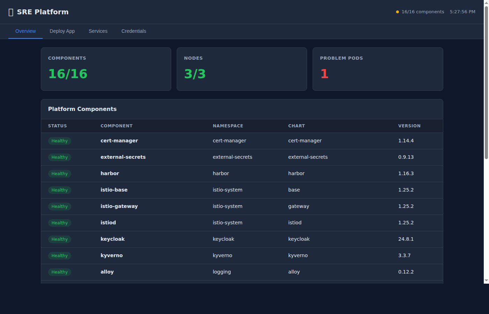
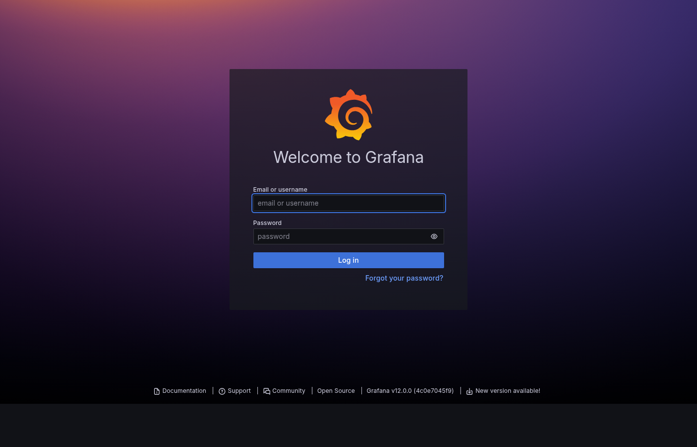
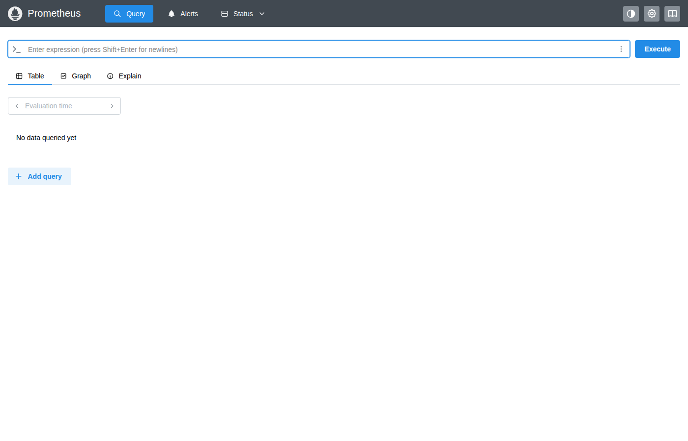
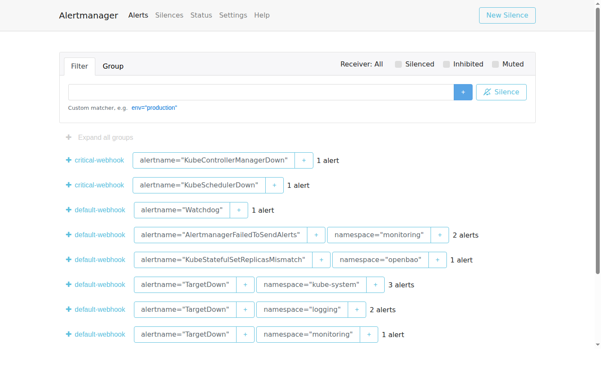
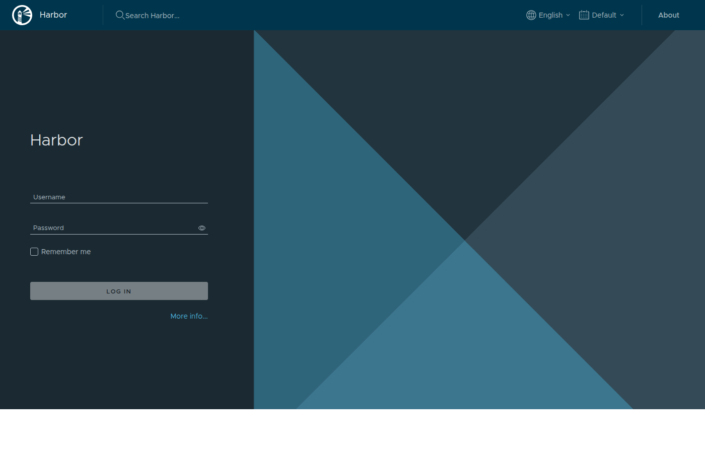
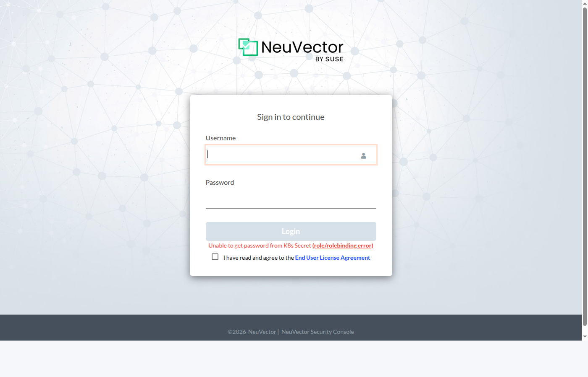
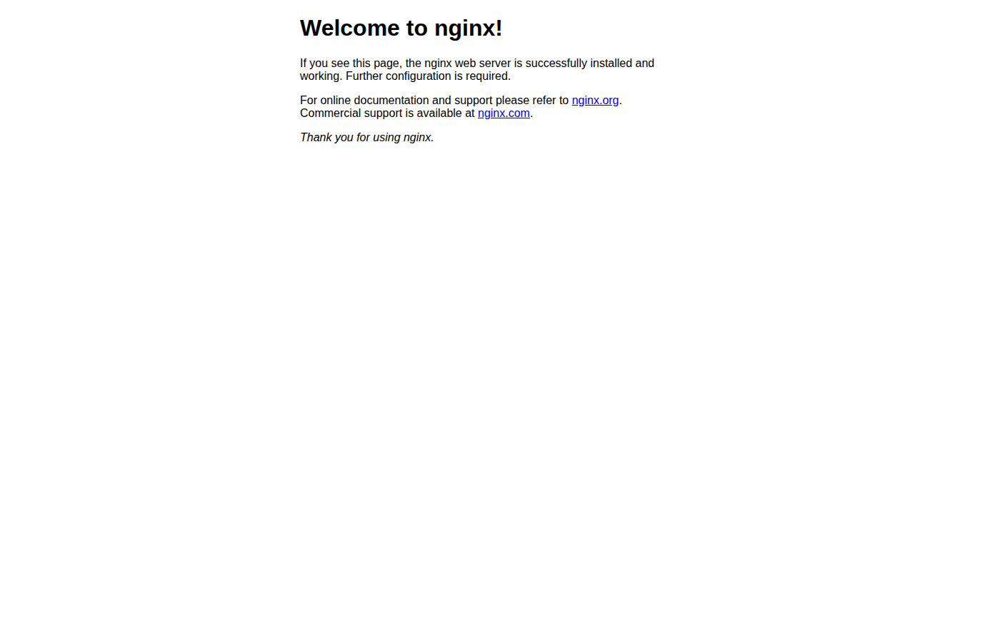

# Secure Runtime Environment (SRE)

A hardened, compliance-ready Kubernetes platform for deploying applications in regulated environments. One-click deploy, zero-trust security, full observability — all open source.

[](LICENSE)
[](https://docs.rke2.io)
[](https://fluxcd.io)
[](#platform-components)

---

## What You Get

A complete Kubernetes platform with 16 integrated components, all deployed and managed through GitOps:



| Category | Components | What It Does |
|----------|-----------|-------------|
| **Service Mesh** | Istio | Encrypts all pod-to-pod traffic (mTLS), controls who can talk to whom |
| **Policy Engine** | Kyverno | Blocks insecure containers, enforces image signing, requires labels |
| **Monitoring** | Prometheus + Grafana + Alertmanager | Metrics, dashboards, and alerting for the entire cluster |
| **Logging** | Loki + Alloy | Centralized log collection and search from every pod |
| **Tracing** | Tempo | Distributed request tracing across services |
| **Runtime Security** | NeuVector | Detects and blocks anomalous container behavior in real time |
| **Secrets** | OpenBao + External Secrets Operator | Centralized secrets vault with automatic Kubernetes sync |
| **Certificates** | cert-manager | Automated TLS certificate issuance and rotation |
| **Identity** | Keycloak | Single sign-on (SSO) with OIDC/SAML for all platform UIs |
| **Registry** | Harbor + Trivy | Container image storage with vulnerability scanning on push |
| **Backup** | Velero | Scheduled cluster backup and disaster recovery |
| **GitOps** | Flux CD | Continuously reconciles cluster state from this Git repo |

---

## Accessing the Platform

All platform UIs are exposed through a single Istio ingress gateway using HTTPS on NodePort **31443**. Here's how to access everything.

### Step 1: Add DNS entries

Pick any cluster node IP and add these to your `/etc/hosts`:

```bash
# Replace 192.168.2.104 with your node IP
echo "192.168.2.104  dashboard.apps.sre.example.com grafana.apps.sre.example.com prometheus.apps.sre.example.com alertmanager.apps.sre.example.com harbor.apps.sre.example.com keycloak.apps.sre.example.com neuvector.apps.sre.example.com" | sudo tee -a /etc/hosts
```

> **How it works:** The Istio ingress gateway listens on every node's port 31443. When a request arrives, Istio reads the `Host` header and routes it to the correct backend service via VirtualService rules. All traffic is TLS-encrypted with a self-signed wildcard certificate for `*.apps.sre.example.com`.

### Step 2: Open any service

All URLs follow the pattern: `https://<service>.apps.sre.example.com:31443`

| Service | URL | Default Credentials |
|---------|-----|-------------------|
| **Dashboard** | `https://dashboard.apps.sre.example.com:31443` | No login required |
| **Grafana** | `https://grafana.apps.sre.example.com:31443` | `admin` / `prom-operator` |
| **Prometheus** | `https://prometheus.apps.sre.example.com:31443` | No login required |
| **Alertmanager** | `https://alertmanager.apps.sre.example.com:31443` | No login required |
| **Harbor** | `https://harbor.apps.sre.example.com:31443` | `admin` / `Harbor12345` |
| **Keycloak** | `https://keycloak.apps.sre.example.com:31443` | `admin` / (auto-generated, see below) |
| **NeuVector** | `https://neuvector.apps.sre.example.com:31443` | `admin` / `admin` |

> Your browser will warn about the self-signed certificate — click through it or use `curl -k`.

### Step 3: Get credentials

```bash
# Show all service URLs and credentials
./scripts/sre-access.sh

# Just credentials
./scripts/sre-access.sh creds

# Health check
./scripts/sre-access.sh status
```

### How the Networking Works

```
                    Internet / LAN
                         │
                    ┌────▼────┐
                    │  Node   │  (any node IP, port 31443)
                    │ NodePort│
                    └────┬────┘
                         │
                ┌────────▼────────┐
                │  Istio Gateway  │  TLS termination
                │  (istio-system) │  Host-based routing
                └────────┬────────┘
                         │
         ┌───────────────┼───────────────┐
         │               │               │
    ┌────▼────┐    ┌────▼────┐    ┌────▼────┐
    │ Grafana │    │ Harbor  │    │ Your App│
    │ :3000   │    │ :8080   │    │ :8080   │
    └─────────┘    └─────────┘    └─────────┘
```

**Traffic flow for `https://grafana.apps.sre.example.com:31443`:**
1. DNS resolves to a cluster node IP (from `/etc/hosts` or real DNS)
2. HTTPS hits NodePort 31443 on that node
3. Istio Gateway terminates TLS using the wildcard certificate
4. Istio reads the `Host: grafana.apps.sre.example.com` header
5. VirtualService rule matches and routes to `kube-prometheus-stack-grafana.monitoring.svc:80`
6. Grafana serves the response back through the same path

---

## Screenshots

### SRE Dashboard
One-click app deployment, platform health monitoring, service discovery, and credential management.


### Grafana — Metrics & Dashboards
Cluster health, namespace resource usage, Istio traffic, Kyverno violations, and custom dashboards.



### Prometheus — Metrics Query
Direct PromQL access for ad-hoc queries and debugging.



### Alertmanager — Active Alerts
Alert grouping, silencing, and routing configuration.



### Harbor — Container Registry
Image storage with automatic Trivy vulnerability scanning, Cosign signature verification, and replication.



### NeuVector — Runtime Security
Container behavioral monitoring, network microsegmentation, and CIS benchmark scanning.



### Demo App — Deployed via Dashboard
A sample nginx app deployed through the dashboard, running with Istio mTLS sidecar injection.



---

## Quick Start

### Deploy to Any Existing Kubernetes Cluster

If you already have a Kubernetes cluster with `kubectl` access:

```bash
git clone https://github.com/morbidsteve/sre-platform.git
cd sre-platform
./scripts/sre-deploy.sh
```

The script handles everything: storage provisioning, kernel modules, Flux CD bootstrap, secret generation, and waits until all components are healthy (~10 minutes).

When it finishes:

```bash
./scripts/sre-access.sh          # Show all URLs and credentials
```

### Deploy from Scratch on Proxmox VE

Build a full cluster from bare metal:

```bash
git clone https://github.com/morbidsteve/sre-platform.git
cd sre-platform
./scripts/quickstart-proxmox.sh
```

See the [Proxmox Getting Started Guide](docs/getting-started-proxmox.md) for details.

### Deploy on Cloud (AWS, Azure, vSphere)

```bash
git clone https://github.com/morbidsteve/sre-platform.git
cd sre-platform

# 1. Provision infrastructure
task infra-plan ENV=dev
task infra-apply ENV=dev

# 2. Harden OS + install RKE2
cd infrastructure/ansible
ansible-playbook playbooks/site.yml -i inventory/dev/hosts.yml

# 3. Deploy the platform
cd ../..
./scripts/sre-deploy.sh
```

---

## Deploy Your App

### Option A: Web Dashboard (30 seconds)

1. Open `https://dashboard.apps.sre.example.com:31443`
2. Click **Deploy App**
3. Fill in: name, team, image, tag, port
4. Click **Deploy**

The platform automatically adds security contexts, network policies, Istio mTLS, health probes, and Prometheus monitoring.

### Option B: CLI

```bash
# Create a team namespace (one-time)
./scripts/sre-new-tenant.sh my-team

# Deploy your app (interactive)
./scripts/sre-deploy-app.sh

# Push to Git — Flux handles the rest
git push
```

### Option C: GitOps (manual YAML)

Create `apps/tenants/my-team/my-app.yaml`:

```yaml
apiVersion: helm.toolkit.fluxcd.io/v2
kind: HelmRelease
metadata:
  name: my-app
  namespace: team-my-team
spec:
  interval: 10m
  chart:
    spec:
      chart: ./apps/templates/sre-web-app
      reconcileStrategy: Revision
      sourceRef:
        kind: GitRepository
        name: flux-system
        namespace: flux-system
  values:
    app:
      name: my-app
      team: my-team
      image:
        repository: nginx
        tag: "1.27-alpine"
      port: 8080
    ingress:
      enabled: true
      host: my-app.apps.sre.example.com
```

Commit and push — Flux deploys it automatically.

### Container Requirements

Your container must:
- Run as **non-root** (UID 1000+)
- Listen on port **8080+** (not 80 or 443)
- Use a **pinned version tag** (not `:latest`)

> Can't run as non-root? Use `nginxinc/nginx-unprivileged` instead of `nginx`, or add `USER 1000` to your Dockerfile.

---

## Architecture

SRE is composed of four layers:

```
┌─────────────────────────────────────────────────┐
│  Layer 4: Supply Chain Security                  │
│  Harbor + Trivy scanning + Cosign signing        │
│  + Kyverno image verification                    │
├─────────────────────────────────────────────────┤
│  Layer 3: Developer Experience                   │
│  Helm templates + Tenant namespaces              │
│  + SRE Dashboard + GitOps app deployment         │
├─────────────────────────────────────────────────┤
│  Layer 2: Platform Services (Flux CD)            │
│  Istio + Kyverno + Prometheus + Grafana + Loki   │
│  + NeuVector + OpenBao + cert-manager + Keycloak │
│  + Tempo + Velero + External Secrets             │
├─────────────────────────────────────────────────┤
│  Layer 1: Cluster Foundation                     │
│  RKE2 (FIPS + CIS + STIG) on Rocky Linux 9      │
│  Provisioned by OpenTofu + Ansible + Packer      │
└─────────────────────────────────────────────────┘
```

**Layer 1 — Cluster Foundation:** Infrastructure provisioned with OpenTofu (AWS, Azure, vSphere, Proxmox VE), OS hardened to DISA STIG via Ansible, RKE2 installed with FIPS 140-2 and CIS benchmark.

**Layer 2 — Platform Services:** All security, observability, and networking tools deployed via Flux CD. Every component is a HelmRelease in Git, continuously reconciled to the cluster.

**Layer 3 — Developer Experience:** Standardized Helm chart templates and self-service tenant namespaces. Developers deploy apps by committing a values file — the platform handles security contexts, network policies, monitoring, and mesh integration.

**Layer 4 — Supply Chain Security:** Images scanned by Trivy, signed with Cosign, verified by Kyverno at admission, monitored at runtime by NeuVector.

### Security Controls

Every request passes through multiple security layers:

```
Request → TLS Termination → JWT Validation → Authorization Policy → Network Policy → Istio mTLS → Application
                                                                                         ↓
                                                                                 NeuVector Runtime Monitor
```

### GitOps Flow

All changes flow through Git:

```
Developer → git push → GitHub → Flux CD detects change → Kyverno validates → Helm deploys → Pod running
```

No `kubectl apply` needed. No manual cluster access. Git is the single source of truth.

---

## Platform Components

### Component Versions (as deployed)

| Component | Chart Version | Namespace |
|-----------|:------------:|-----------|
| Istio (base + istiod + gateway) | 1.25.2 | istio-system |
| cert-manager | v1.14.4 | cert-manager |
| Kyverno | 3.3.7 | kyverno |
| kube-prometheus-stack | 72.6.2 | monitoring |
| Loki | 6.29.0 | logging |
| Alloy | 0.12.2 | logging |
| Tempo | 1.18.2 | tempo |
| OpenBao | 0.9.0 | openbao |
| External Secrets | 0.9.13 | external-secrets |
| NeuVector | 2.8.6 | neuvector |
| Velero | 11.3.2 | velero |
| Harbor | 1.16.3 | harbor |
| Keycloak | 24.8.1 | keycloak |

### Kyverno Policies (7 active, Audit mode)

| Policy | What It Enforces |
|--------|-----------------|
| `disallow-default-namespace` | Blocks deployments to the `default` namespace |
| `disallow-latest-tag` | Blocks `:latest` image tags |
| `require-labels` | Requires `app.kubernetes.io/name` and `sre.io/team` labels |
| `require-network-policies` | Ensures every namespace has a default-deny NetworkPolicy |
| `require-probes` | Requires liveness and readiness probes on all containers |
| `require-resource-limits` | Requires CPU and memory limits on all containers |
| `restrict-image-registries` | Restricts images to approved registries |

---

## Project Structure

```
sre-platform/
├── platform/                     # Flux CD GitOps manifests
│   ├── flux-system/              # Flux bootstrap
│   ├── core/                     # 13 core platform components
│   │   ├── istio/                # Service mesh (mTLS, gateway, auth)
│   │   ├── cert-manager/         # TLS certificates
│   │   ├── kyverno/              # Policy engine
│   │   ├── monitoring/           # Prometheus + Grafana + Alertmanager
│   │   ├── logging/              # Loki + Alloy
│   │   ├── tracing/              # Tempo
│   │   ├── openbao/              # Secrets vault
│   │   ├── external-secrets/     # Secrets sync to K8s
│   │   ├── runtime-security/     # NeuVector
│   │   └── backup/               # Velero
│   └── addons/                   # Optional components
│       ├── harbor/               # Container registry
│       └── keycloak/             # Identity / SSO
├── apps/
│   ├── dashboard/                # SRE Dashboard web app
│   ├── templates/                # Helm chart templates (web-app, worker, cronjob, api)
│   └── tenants/                  # Per-team app configs (team-alpha, team-beta)
├── policies/                     # Kyverno policies + test suites
├── infrastructure/
│   ├── tofu/                     # OpenTofu modules (AWS, Azure, vSphere, Proxmox)
│   ├── ansible/                  # OS hardening + RKE2 install
│   └── packer/                   # Immutable VM image builds
├── compliance/                   # OSCAL, STIG checklists, NIST mappings
├── scripts/                      # Deploy, access, and management scripts
└── docs/                         # Full documentation
```

---

## Compliance

SRE targets these government and industry compliance frameworks:

| Framework | Coverage |
|-----------|----------|
| **NIST 800-53 Rev 5** | AC, AU, CA, CM, IA, IR, MP, RA, SA, SC, SI control families |
| **CMMC 2.0 Level 2** | All 110 NIST 800-171 controls |
| **DISA STIGs** | RKE2 Kubernetes, RHEL 9 / Rocky Linux 9, Istio |
| **FedRAMP** | NIST 800-53 control inheritance + OSCAL artifacts |
| **CIS Benchmarks** | Kubernetes (via RKE2), Rocky Linux 9 Level 2 |

Every Kyverno policy, Helm chart, and Flux manifest includes `sre.io/nist-controls` annotations mapping to specific NIST 800-53 controls.

---

## Scripts Reference

| Script | Description |
|--------|-------------|
| `scripts/sre-deploy.sh` | One-button platform install on any K8s cluster |
| `scripts/sre-access.sh` | Show all service URLs, credentials, and health status |
| `scripts/sre-access.sh status` | Quick health check (all HelmReleases + problem pods) |
| `scripts/sre-access.sh creds` | Show credentials for all platform services |
| `scripts/sre-new-tenant.sh <team>` | Create a team namespace with RBAC, quotas, network policies |
| `scripts/sre-deploy-app.sh` | Interactive app deployment (generates HelmRelease) |
| `apps/dashboard/build-and-deploy.sh` | Build and deploy the SRE Dashboard to the cluster |

---

## Documentation

| Guide | Description |
|-------|-------------|
| [Architecture](docs/architecture.md) | Full platform spec and design rationale |
| [Decision Records](docs/decisions.md) | ADRs for all major technology choices |
| [Developer Guide](docs/developer-guide.md) | Deploy your app in 5 minutes |
| [Proxmox Guide](docs/getting-started-proxmox.md) | Build a cluster from scratch on Proxmox VE |
| [Session Playbook](docs/session-playbook.md) | Step-by-step build plan |

---

## Contributing

**Branch naming:** `feat/`, `fix/`, `docs/`, `refactor/` prefixes

**Commit format:** [Conventional Commits](https://www.conventionalcommits.org/) — `feat(istio): add strict mTLS peer authentication`

**Requirements:**
- `task lint` and `task validate` must pass
- Every component needs a `README.md`
- All Kyverno policies need test suites
- All Helm charts need `values.schema.json`
- Never use `:latest` tags — pin specific versions
- Never commit secrets or credentials

---

## License

Apache License, Version 2.0. See [LICENSE](LICENSE).
