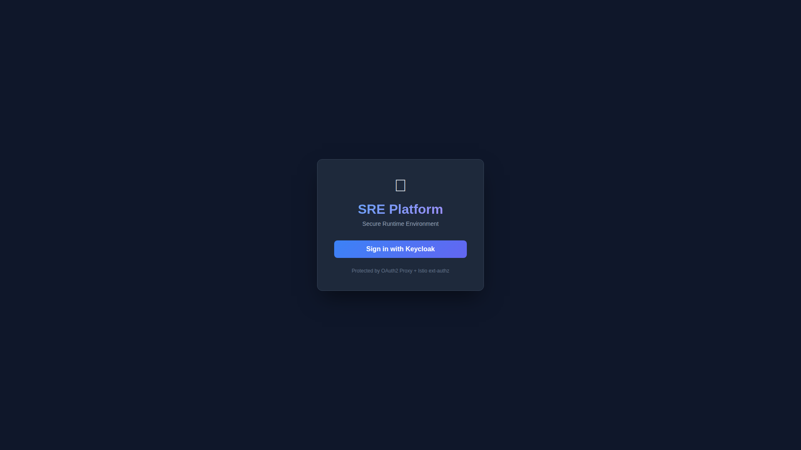
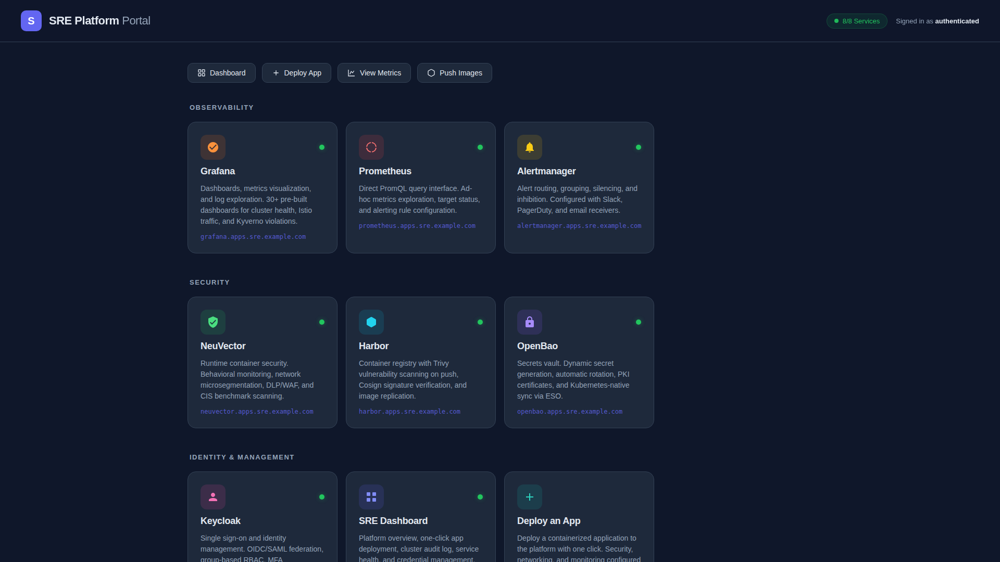
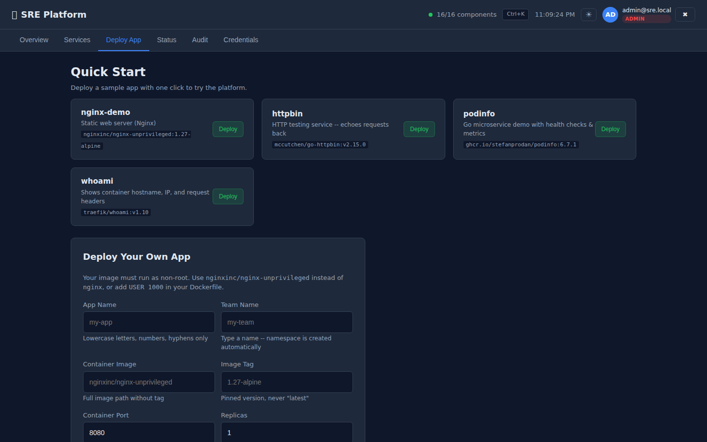
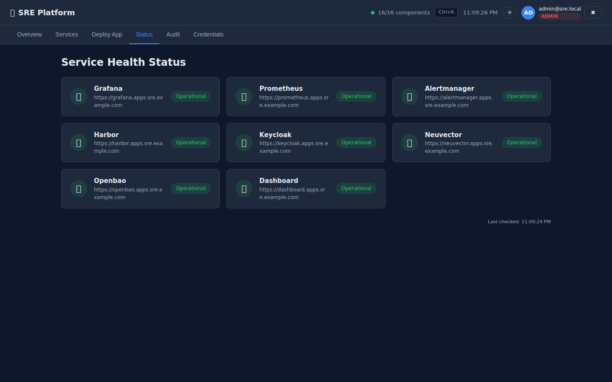
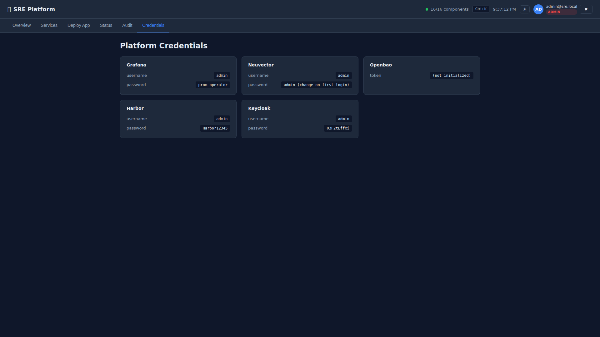
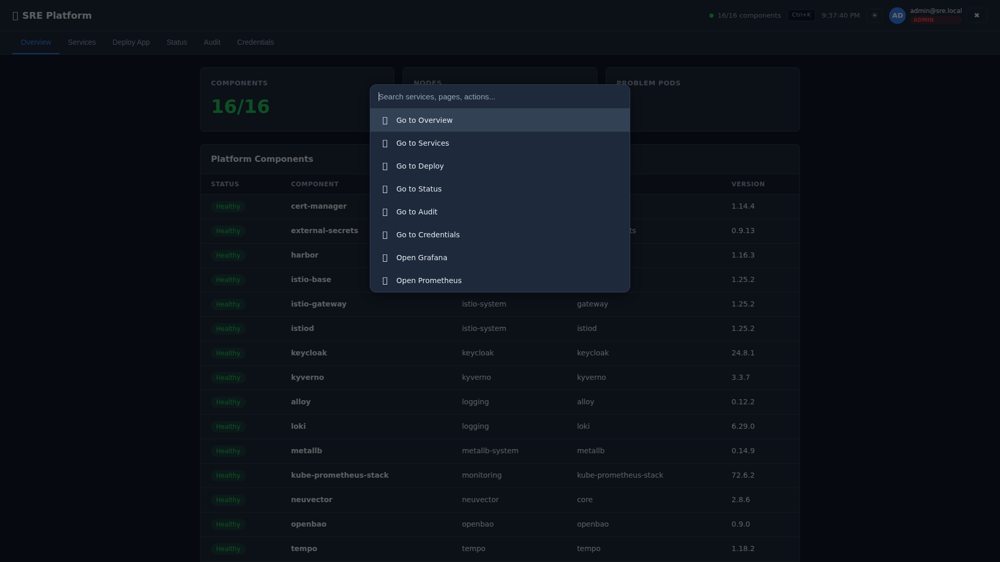
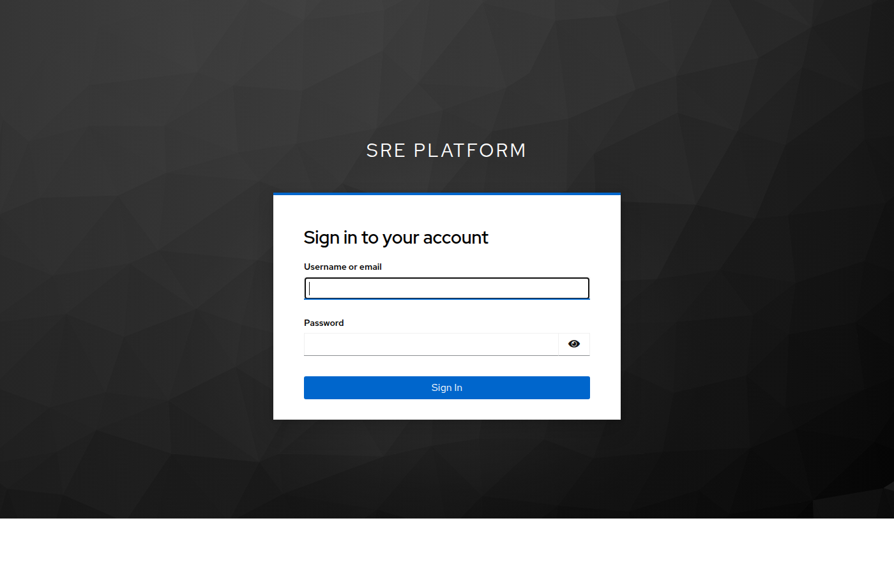
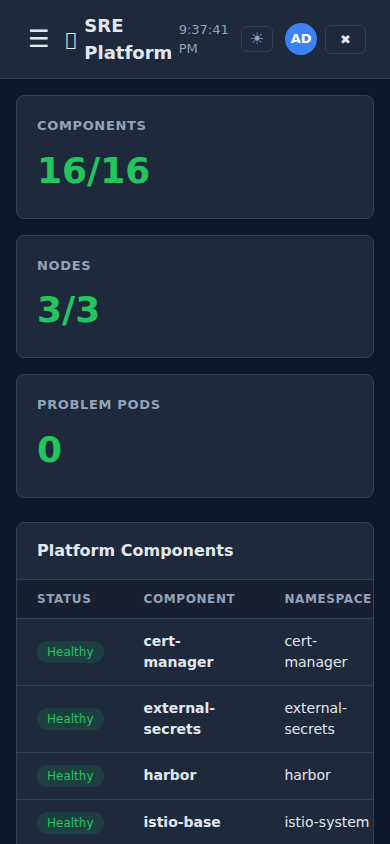

# Secure Runtime Environment (SRE)

A hardened, compliance-ready Kubernetes platform for deploying applications in regulated environments. One-click deploy, zero-trust security, full observability — all open source.

[](#compliance--dsopropc-ready)
[](#security-gates-raise-20)
[](LICENSE)
[](https://docs.rke2.io)
[](https://fluxcd.io)
[](#platform-components)
[](#policy-enforcement-18-kyverno-clusterpolicies)
[](#compliance--dsopropc-ready)

---

## What You Get

A complete Kubernetes platform with 16 integrated HelmReleases, 18 Kyverno policies, and all 8 RAISE 2.0 security gates — deployed and managed through GitOps:


| Category | Components | What It Does |
|----------|-----------|-------------|
| **Service Mesh** | Istio | Encrypts all pod-to-pod traffic (mTLS), controls who can talk to whom |
| **Policy Engine** | Kyverno | Blocks insecure containers, enforces image signing, requires labels |
| **Monitoring** | Prometheus + Grafana + Alertmanager | Metrics, dashboards, and alerting for the entire cluster |
| **Logging** | Loki + Alloy | Centralized log collection and search from every pod |
| **Tracing** | Tempo | Distributed request tracing across services |
| **Runtime Security** | NeuVector | Detects and blocks anomalous container behavior in real time |
| **Secrets** | OpenBao + External Secrets Operator | Centralized secrets vault with automatic Kubernetes sync |
| **Certificates** | cert-manager | Automated TLS certificate issuance and rotation |
| **Identity** | Keycloak | Single sign-on (SSO) with OIDC/SAML for all platform UIs |
| **Registry** | Harbor + Trivy | Container image storage with vulnerability scanning on push |
| **Backup** | Velero | Scheduled cluster backup and disaster recovery |
| **Load Balancer** | MetalLB | Provides LoadBalancer IPs on bare metal (cloud uses native LB) |
| **GitOps** | Flux CD | Continuously reconciles cluster state from this Git repo |

---

## Accessing the Platform

All platform UIs are exposed through a single Istio ingress gateway on standard HTTPS (port 443). No custom ports needed.

### Step 1: Add DNS entries

Get the gateway IP and add DNS entries:

```bash
# Get the gateway's external IP (assigned by MetalLB on bare metal, or cloud LB on AWS/Azure)
GATEWAY_IP=$(kubectl get svc istio-gateway -n istio-system -o jsonpath='{.status.loadBalancer.ingress[0].ip}')

# Add to /etc/hosts (or configure real DNS in production)
echo "$GATEWAY_IP  portal.apps.sre.example.com dashboard.apps.sre.example.com grafana.apps.sre.example.com prometheus.apps.sre.example.com alertmanager.apps.sre.example.com harbor.apps.sre.example.com keycloak.apps.sre.example.com neuvector.apps.sre.example.com openbao.apps.sre.example.com oauth2.apps.sre.example.com" | sudo tee -a /etc/hosts
```

> **How it works:** The Istio ingress gateway gets a dedicated IP via LoadBalancer (MetalLB on bare metal, cloud LB on AWS/Azure). When a request arrives on port 443, Istio reads the `Host` header and routes it to the correct backend service via VirtualService rules. All traffic is TLS-encrypted with a wildcard certificate for `*.apps.sre.example.com`.

### Step 2: Open any service

All URLs follow the pattern: `https://<service>.apps.sre.example.com`

| Service | URL | Default Credentials |
|---------|-----|-------------------|
| **Portal** | `https://portal.apps.sre.example.com` | SSO via Keycloak |
| **Dashboard** | `https://dashboard.apps.sre.example.com` | SSO via Keycloak |
| **Grafana** | `https://grafana.apps.sre.example.com` | SSO via Keycloak (or `admin` / `prom-operator`) |
| **Prometheus** | `https://prometheus.apps.sre.example.com` | SSO via Keycloak |
| **Alertmanager** | `https://alertmanager.apps.sre.example.com` | SSO via Keycloak |
| **Harbor** | `https://harbor.apps.sre.example.com` | SSO via Keycloak (or `admin` / `Harbor12345`) |
| **Keycloak** | `https://keycloak.apps.sre.example.com` | `admin` / (auto-generated, see below) |
| **NeuVector** | `https://neuvector.apps.sre.example.com` | SSO via Keycloak (or `admin` / `admin`) |
| **OpenBao** | `https://openbao.apps.sre.example.com` | SSO via Keycloak |

> **SSO:** All services (except Keycloak itself) are behind Single Sign-On. Clicking any link redirects you to Keycloak to log in once, then you're authenticated across all services.

> Your browser will warn about the self-signed certificate — click through it or use `curl -k`.

### Step 3: Get credentials

```bash
# Show all service URLs and credentials
./scripts/sre-access.sh

# Just credentials
./scripts/sre-access.sh creds

# Health check
./scripts/sre-access.sh status
```

### How the Networking Works

```
                    Internet / LAN
                         │
                  ┌──────▼──────┐
                  │ LoadBalancer │  Dedicated IP (MetalLB / cloud LB)
                  │  :443 :80   │  Standard HTTPS/HTTP ports
                  └──────┬──────┘
                         │
                ┌────────▼────────┐
                │  Istio Gateway  │  TLS termination
                │  (istio-system) │  Host-based routing
                └────────┬────────┘
                         │
         ┌───────────────┼───────────────┐
         │               │               │
    ┌────▼────┐    ┌────▼────┐    ┌────▼────┐
    │ Grafana │    │ Harbor  │    │ Your App│
    │ :3000   │    │ :8080   │    │ :8080   │
    └─────────┘    └─────────┘    └─────────┘
```

**Traffic flow for `https://grafana.apps.sre.example.com`:**
1. DNS resolves to the gateway's LoadBalancer IP
2. HTTPS hits port 443 on that IP
3. Istio Gateway terminates TLS using the wildcard certificate
4. Istio reads the `Host: grafana.apps.sre.example.com` header
5. VirtualService rule matches and routes to `kube-prometheus-stack-grafana.monitoring.svc:80`
6. Grafana serves the response back through the same path

---

## User Walkthrough

Here's exactly what it looks like when you use the platform, from first login to deploying an app.

### 1. SSO Gate — Every Service is Protected
Visit any URL and you're redirected to sign in. One login, access everywhere.



### 2. Keycloak Login
Enter your credentials (default: `sre-admin` / `SreAdmin123!`). Once signed in, you're authenticated across all services.


### 3. Portal — Your Starting Point
The portal is your home page. It shows all platform services with health status, quick actions, and direct links.



### 4. Dashboard — Platform Overview
Click "Dashboard" from the portal. See all 16 components, 3 nodes, and problem pods at a glance.


### 5. Services Tab — Direct Links to Everything
Browse all services with health indicators, descriptions, and one-click access.


### 6. Deploy Tab — One-Click App Deployment
Quick-start templates for instant demos, or use the custom form to deploy your own image.



### 7. Status Page — Shareable Health View
Operational status of every platform service. Share this URL with your team.



### 8. Audit Log — Cluster Events
Tabular view with type filters, namespace filter, pagination, and color-coded badges.


### 9. Credentials — Quick Access to Passwords
View service credentials without needing `kubectl`.



### 10. Command Palette (Ctrl+K)
Quick-search to jump to any page or external service.



### 11. Grafana — 30+ Dashboards
Cluster health, namespace resources, Istio traffic, Kyverno violations, and more.


### 12. Harbor — Container Registry
Image storage with Trivy vulnerability scanning on push.


### 13. Keycloak Admin — Identity Management
Manage users, groups, OIDC clients, and SSO configuration.



### 14. Mobile Responsive
Portal and dashboard adapt to mobile screens for on-the-go health checks.



> **Full user stories with walkthroughs:** See [docs/user-stories.md](docs/user-stories.md) for detailed personas and step-by-step workflows for Platform Admins, Developers, Security Officers, Team Leads, New Hires, and Incident Responders.


---

## Quick Start

### Deploy to Any Existing Kubernetes Cluster

If you already have a Kubernetes cluster with `kubectl` access:

```bash
git clone https://github.com/morbidsteve/sre-platform.git
cd sre-platform
./scripts/sre-deploy.sh
```

The script handles everything: storage provisioning, kernel modules, Flux CD bootstrap, secret generation, and waits until all components are healthy (~10 minutes).

When it finishes:

```bash
./scripts/sre-access.sh          # Show all URLs and credentials
```

### Deploy from Scratch on Proxmox VE

Build a full cluster from bare metal:

```bash
git clone https://github.com/morbidsteve/sre-platform.git
cd sre-platform
./scripts/quickstart-proxmox.sh
```

See the [Proxmox Getting Started Guide](docs/getting-started-proxmox.md) for details.

### Deploy on Cloud (AWS, Azure, vSphere)

```bash
git clone https://github.com/morbidsteve/sre-platform.git
cd sre-platform

# 1. Provision infrastructure
task infra-plan ENV=dev
task infra-apply ENV=dev

# 2. Harden OS + install RKE2
cd infrastructure/ansible
ansible-playbook playbooks/site.yml -i inventory/dev/hosts.yml

# 3. Deploy the platform
cd ../..
./scripts/sre-deploy.sh
```

---

## Deploy Your App

### Option A: Web Dashboard (30 seconds)

1. Open `https://dashboard.apps.sre.example.com`
2. Click **Deploy App**
3. Fill in: name, team, image, tag, port
4. Click **Deploy**

The platform automatically adds security contexts, network policies, Istio mTLS, health probes, and Prometheus monitoring.

### Option B: CLI

```bash
# Create a team namespace (one-time)
./scripts/sre-new-tenant.sh my-team

# Deploy your app (interactive)
./scripts/sre-deploy-app.sh

# Push to Git — Flux handles the rest
git push
```

### Option C: GitOps (manual YAML)

Create `apps/tenants/my-team/my-app.yaml`:

```yaml
apiVersion: helm.toolkit.fluxcd.io/v2
kind: HelmRelease
metadata:
  name: my-app
  namespace: team-my-team
spec:
  interval: 10m
  chart:
    spec:
      chart: ./apps/templates/sre-web-app
      reconcileStrategy: Revision
      sourceRef:
        kind: GitRepository
        name: flux-system
        namespace: flux-system
  values:
    app:
      name: my-app
      team: my-team
      image:
        repository: nginx
        tag: "1.27-alpine"
      port: 8080
    ingress:
      enabled: true
      host: my-app.apps.sre.example.com
```

Commit and push — Flux deploys it automatically.

### Container Requirements

Your container must:
- Run as **non-root** (UID 1000+)
- Listen on port **8080+** (not 80 or 443)
- Use a **pinned version tag** (not `:latest`)

> Can't run as non-root? Use `nginxinc/nginx-unprivileged` instead of `nginx`, or add `USER 1000` to your Dockerfile.

---

## Architecture

SRE is composed of four layers:

```
┌─────────────────────────────────────────────────┐
│  Layer 4: Supply Chain Security                  │
│  Harbor + Trivy scanning + Cosign signing        │
│  + Kyverno image verification                    │
├─────────────────────────────────────────────────┤
│  Layer 3: Developer Experience                   │
│  Helm templates + Tenant namespaces              │
│  + SRE Dashboard + GitOps app deployment         │
├─────────────────────────────────────────────────┤
│  Layer 2: Platform Services (Flux CD)            │
│  Istio + Kyverno + Prometheus + Grafana + Loki   │
│  + NeuVector + OpenBao + cert-manager + Keycloak │
│  + Tempo + Velero + External Secrets             │
├─────────────────────────────────────────────────┤
│  Layer 1: Cluster Foundation                     │
│  RKE2 (FIPS + CIS + STIG) on Rocky Linux 9      │
│  Provisioned by OpenTofu + Ansible + Packer      │
└─────────────────────────────────────────────────┘
```

**Layer 1 — Cluster Foundation:** Infrastructure provisioned with OpenTofu (AWS, Azure, vSphere, Proxmox VE), OS hardened to DISA STIG via Ansible, RKE2 installed with FIPS 140-2 and CIS benchmark.

**Layer 2 — Platform Services:** All security, observability, and networking tools deployed via Flux CD. Every component is a HelmRelease in Git, continuously reconciled to the cluster.

**Layer 3 — Developer Experience:** Standardized Helm chart templates and self-service tenant namespaces. Developers deploy apps by committing a values file — the platform handles security contexts, network policies, monitoring, and mesh integration.

**Layer 4 — Supply Chain Security:** Images scanned by Trivy, signed with Cosign, verified by Kyverno at admission, monitored at runtime by NeuVector.

### Security Controls

Every request passes through multiple security layers:

```
Request → TLS Termination → JWT Validation → Authorization Policy → Network Policy → Istio mTLS → Application
                                                                                         ↓
                                                                                 NeuVector Runtime Monitor
```

### GitOps Flow

All changes flow through Git:

```
Developer → git push → GitHub → Flux CD detects change → Kyverno validates → Helm deploys → Pod running
```

No `kubectl apply` needed. No manual cluster access. Git is the single source of truth.

### Zero-Trust Security Model

Every layer enforces security independently — compromising one layer doesn't bypass the others:

| Layer | Control | What It Prevents |
|-------|---------|-----------------|
| **Gateway** | Istio ext-authz + OAuth2 Proxy | Unauthenticated access to any service |
| **Mesh** | Istio mTLS STRICT | Unencrypted pod-to-pod communication |
| **Network** | NetworkPolicy default-deny | Lateral movement between namespaces |
| **Admission** | Kyverno 18 policies | Privileged containers, unsigned images, `:latest` tags, missing labels/probes |
| **Runtime** | NeuVector | Anomalous process execution, network exfiltration |
| **Secrets** | OpenBao + ESO | Hardcoded credentials, secret sprawl |
| **Audit** | Prometheus + Loki + Tempo | Unmonitored activity, missing forensic data |

---

## Platform Components

### Component Versions (as deployed)

| Component | Chart Version | Namespace |
|-----------|:------------:|-----------|
| Istio (base + istiod + gateway) | 1.25.2 | istio-system |
| cert-manager | v1.14.4 | cert-manager |
| Kyverno | 3.3.7 | kyverno |
| kube-prometheus-stack | 72.6.2 | monitoring |
| Loki | 6.29.0 | logging |
| Alloy | 0.12.2 | logging |
| Tempo | 1.18.2 | tempo |
| OpenBao | 0.9.0 | openbao |
| External Secrets | 0.9.13 | external-secrets |
| NeuVector | 2.8.6 | neuvector |
| Velero | 11.3.2 | velero |
| Harbor | 1.16.3 | harbor |
| Keycloak | 24.8.1 | keycloak |
| MetalLB | 0.14.9 | metallb-system |

### Policy Enforcement (18 Kyverno ClusterPolicies)

All 18 policies are in **Enforce** mode. They are organized into three tiers aligned with Kubernetes Pod Security Standards and SRE-specific requirements.

**Baseline Tier** (4 policies) — Applied cluster-wide. Prevents known privilege escalation vectors.

| Policy | What It Enforces |
|--------|-----------------|
| `disallow-privileged` | Blocks privileged containers |
| `disallow-host-namespaces` | Blocks hostPID, hostIPC, hostNetwork |
| `disallow-host-ports` | Blocks hostPort mappings |
| `restrict-sysctls` | Restricts unsafe sysctl settings |

**Restricted Tier** (4 policies) — Applied to all tenant namespaces. Enforces hardened pod security.

| Policy | What It Enforces |
|--------|-----------------|
| `require-run-as-nonroot` | Requires non-root user |
| `require-drop-all-capabilities` | Requires `drop: ALL` capabilities |
| `disallow-privilege-escalation` | Blocks `allowPrivilegeEscalation: true` |
| `restrict-volume-types` | Limits volume types to safe list |

**Custom Tier** (10 policies) — SRE-specific operational and supply chain policies.

| Policy | What It Enforces |
|--------|-----------------|
| `disallow-latest-tag` | Blocks `:latest` image tags |
| `require-labels` | Requires `app.kubernetes.io/name` and `sre.io/team` labels |
| `require-network-policies` | Ensures every namespace has a default-deny NetworkPolicy |
| `require-security-context` | Requires non-root, read-only rootfs, drop ALL capabilities |
| `restrict-image-registries` | Restricts images to approved registries |
| `require-istio-sidecar` | Requires Istio sidecar injection labels on namespaces |
| `require-probes` | Requires liveness and readiness probes |
| `require-resource-limits` | Requires CPU and memory resource limits |
| `require-security-categorization` | Requires security classification labels |
| `verify-image-signatures` | Verifies Cosign signatures on container images |

### Secrets Management

| Feature | Implementation |
|---------|---------------|
| **Secrets Vault** | OpenBao (auto-initialized, auto-unsealed) |
| **K8s Integration** | External Secrets Operator syncs from OpenBao to K8s Secrets |
| **Auth Method** | Kubernetes ServiceAccount-based authentication |
| **Engines** | KV v2 (app secrets), PKI (certificates) |

### SSO / Identity (Keycloak + OAuth2 Proxy)

All platform services are protected by SSO via Keycloak + OAuth2 Proxy + Istio ext-authz. A single login grants access to every service.

| Feature | Detail |
|---------|--------|
| **Realm** | `sre` with OIDC discovery |
| **Groups** | `sre-admins`, `developers`, `sre-viewers` |
| **OIDC Clients** | Grafana, Harbor, NeuVector, Dashboard, OAuth2 Proxy |
| **SSO Gate** | OAuth2 Proxy + Istio ext-authz on the gateway |
| **Test User** | `sre-admin` / `SreAdmin123!` (in `sre-admins` group) |

**How SSO works:**
1. User visits any service URL (e.g., `https://grafana.apps.sre.example.com`)
2. Istio gateway sends the request to OAuth2 Proxy for authentication check
3. If no valid session, OAuth2 Proxy redirects to Keycloak login page
4. User logs in once with Keycloak credentials
5. OAuth2 Proxy sets a session cookie valid across all `*.apps.sre.example.com` services
6. All subsequent requests pass through automatically — no more logins needed

### Observability

| Feature | Detail |
|---------|--------|
| **Grafana Dashboards** | 10+ custom SRE dashboards (cluster, namespace, Istio, Kyverno, Flux, NeuVector) + built-in |
| **PrometheusRules** | 30+ alerts across 8 groups (certs, flux, kyverno, nodes, storage, pods, security, istio) |
| **Alertmanager** | Severity-based routing (critical/warning/info) with Slack, PagerDuty, email receivers |
| **Distributed Tracing** | Istio traces to Tempo (10% sampling) with Grafana integration |
| **Incident Response** | 11 runbooks in `docs/runbooks/` linked from AlertManager alerts |

### Security Gates (RAISE 2.0)

Every container image passes through all 8 RAISE 2.0 security gates before it can run on the platform. Implemented in both GitHub Actions and GitLab CI.

| Gate | Tool | NIST Control | Fail Criteria |
|------|------|:------------:|---------------|
| **GATE 1:** SAST | Semgrep | SA-11 | ERROR-level findings |
| **GATE 2:** SBOM | Syft (SPDX + CycloneDX) | CM-2 | Generation failure |
| **GATE 3:** Secrets Scan | Gitleaks | IA-5 | Any secret detected |
| **GATE 4:** Container Scan | Trivy | RA-5 | CRITICAL findings |
| **GATE 5:** DAST | OWASP ZAP | SA-11 | HIGH-risk alerts |
| **GATE 6:** ISSM Review | GitHub Environment | CA-2 | ISSM rejects |
| **GATE 7:** Image Signing | Cosign + SLSA Provenance | SI-7 | Signing failure |
| **GATE 8:** Artifact Storage | Harbor | CM-8 | Push failure |

Additional supply chain security features:
- **Dual SBOM formats** — SPDX JSON and CycloneDX attached as Cosign attestations
- **SLSA v0.2 provenance** — Generated and signed in both CI systems
- **Kyverno admission** — Verifies Cosign signatures before any pod is created
- **PR-based preview environments** — Ephemeral deployments with automatic DAST scanning

### CI/CD Pipeline

Reusable workflows in `ci/github-actions/` (GitHub Actions) and `ci/gitlab-ci/` (GitLab CI):

1. **Scan secrets** with Gitleaks (GATE 3)
2. **SAST** with Semgrep (GATE 1)
3. **Build** container image with Docker Buildx
4. **Scan** with Trivy, fail on CRITICAL (GATE 4)
5. **Generate SBOM** with Syft in dual format: SPDX + CycloneDX (GATE 2)
6. **ISSM Review** — manual approval gate (GATE 6)
7. **Push** to Harbor (GATE 8)
8. **Sign** with Cosign + attach SBOM + SLSA provenance attestations (GATE 7)
9. **DAST** with OWASP ZAP against deployed app (GATE 5)
10. **Update** GitOps repo (Flux auto-deploys)

### Air-Gap Support

SRE supports fully disconnected (air-gapped) deployments:

| Script | Description |
|--------|-------------|
| `scripts/airgap-mirror-images.sh` | Mirror all platform images to local Harbor |
| `scripts/airgap-export-bundle.sh` | Export images as offline transfer bundle |

---

## Project Structure

```
sre-platform/
├── platform/                     # Flux CD GitOps manifests
│   ├── flux-system/              # Flux bootstrap
│   ├── core/                     # Core platform components
│   │   ├── istio/                # Service mesh (mTLS, gateway, auth)
│   │   ├── cert-manager/         # TLS certificates
│   │   ├── kyverno/              # Policy engine
│   │   ├── monitoring/           # Prometheus + Grafana + Alertmanager
│   │   ├── logging/              # Loki + Alloy
│   │   ├── tracing/              # Tempo
│   │   ├── openbao/              # Secrets vault
│   │   ├── external-secrets/     # Secrets sync to K8s
│   │   ├── runtime-security/     # NeuVector
│   │   └── backup/               # Velero
│   └── addons/                   # Optional components
│       ├── harbor/               # Container registry
│       └── keycloak/             # Identity / SSO
├── apps/
│   ├── portal/                   # SRE Portal — tiled landing page for all services
│   ├── dashboard/                # SRE Dashboard web app (v2.0.2)
│   ├── demo-app/                 # Go demo app with Prometheus metrics
│   ├── templates/                # Helm chart templates (web-app, worker, cronjob, api)
│   └── tenants/                  # Per-team app configs (team-alpha, team-beta)
├── ci/
│   ├── github-actions/           # Reusable GitHub Actions (all 8 RAISE 2.0 gates)
│   └── gitlab-ci/                # Reusable GitLab CI (all 8 RAISE 2.0 gates)
├── policies/                     # 18 Kyverno policies (baseline/restricted/custom) + test suites
├── infrastructure/
│   ├── tofu/                     # OpenTofu modules (AWS, Azure, vSphere, Proxmox)
│   ├── ansible/                  # OS hardening + RKE2 install
│   └── packer/                   # Immutable VM image builds
├── compliance/                   # OSCAL SSP, STIG checklists, NIST mappings, CMMC assessment
├── scripts/                      # Deploy, access, and management scripts
└── docs/                         # Full documentation
```

---

## Compliance — DSOP/RPOC Ready

SRE ships with a complete compliance package ready for government assessment. Every Kyverno policy, Helm chart, and Flux manifest includes `sre.io/nist-controls` annotations mapping to specific NIST 800-53 controls.

### Framework Coverage

| Framework | Coverage | Status |
|-----------|----------|:------:|
| **NIST 800-53 Rev 5** | 49 controls across AC, AU, CA, CM, IA, IR, MP, RA, SA, SC, SI families | Complete |
| **CMMC 2.0 Level 2** | All 110 NIST 800-171 controls | Complete |
| **DISA STIGs** | RKE2 Kubernetes, RHEL 9 / Rocky Linux 9, Istio | Complete |
| **RAISE 2.0** | All 8 security gates enforced in CI/CD | Complete |
| **FedRAMP** | NIST 800-53 control inheritance + OSCAL artifacts | Complete |
| **CIS Benchmarks** | Kubernetes (via RKE2), Rocky Linux 9 Level 2 | Complete |

### Compliance Artifacts

| Artifact | Path | Description |
|----------|------|-------------|
| OSCAL System Security Plan | `compliance/oscal/ssp.json` | Machine-readable SSP in OSCAL format |
| NIST 800-53 Control Mapping | `compliance/nist-800-53-mappings/control-mapping.json` | 49 controls mapped to platform components |
| CMMC 2.0 Level 2 Assessment | `compliance/cmmc/level2-assessment.json` | Self-assessment with implementation evidence |
| RKE2 DISA STIG Checklist | `compliance/stig-checklists/rke2-stig.json` | Pre-filled with SRE implementation status |
| Rocky Linux 9 STIG Checklist | `compliance/stig-checklists/rocky-linux-9.yaml` | OS-level STIG compliance |
| Incident Response Runbooks | `docs/runbooks/` | 11 runbooks linked from AlertManager alerts |

### Automated Compliance Scanning

| Script | Description |
|--------|-------------|
| `scripts/quarterly-stig-scan.sh` | Quarterly DISA STIG compliance scan |
| `scripts/security-pentest.sh` | Security penetration testing script |
| `scripts/validate-compliance.sh` | Continuous compliance validation checks |

---

## Scripts Reference

| Script | Description |
|--------|-------------|
| `scripts/sre-deploy.sh` | One-button platform install on any K8s cluster |
| `scripts/sre-access.sh` | Show all service URLs, credentials, and health status |
| `scripts/sre-access.sh status` | Quick health check (all HelmReleases + problem pods) |
| `scripts/sre-access.sh creds` | Show credentials for all platform services |
| `scripts/sre-new-tenant.sh <team>` | Create a team namespace with RBAC, quotas, network policies |
| `scripts/sre-deploy-app.sh` | Interactive app deployment (generates HelmRelease) |
| `scripts/quarterly-stig-scan.sh` | Run quarterly DISA STIG compliance scan |
| `scripts/security-pentest.sh` | Run security penetration testing |
| `scripts/airgap-mirror-images.sh` | Mirror all platform images to Harbor for air-gap |
| `scripts/airgap-export-bundle.sh` | Export offline bundle for air-gapped transfers |
| `apps/dashboard/build-and-deploy.sh` | Build and deploy the SRE Dashboard to the cluster |

---

## Documentation

| Guide | Description |
|-------|-------------|
| [Architecture](docs/architecture.md) | Full platform spec and design rationale |
| [User Stories](docs/user-stories.md) | Personas, walkthroughs, and screenshots for every user type |
| [Decision Records](docs/decisions.md) | ADRs for all major technology choices |
| [Developer Guide](docs/developer-guide.md) | Deploy your app, secrets management, SSO, CI/CD |
| [Proxmox Guide](docs/getting-started-proxmox.md) | Build a cluster from scratch on Proxmox VE |
| [Session Playbook](docs/session-playbook.md) | Step-by-step build plan |
| [CI/CD Pipelines](ci/README.md) | RAISE 2.0 compliant GitHub Actions + GitLab CI pipelines |
| [Incident Response Runbooks](docs/runbooks/) | 11 runbooks for common platform incidents |
| [Istio AuthZ Policies](platform/core/istio-config/authorization-policies/README.md) | Zero-trust network policies |

---

## Contributing

**Branch naming:** `feat/`, `fix/`, `docs/`, `refactor/` prefixes

**Commit format:** [Conventional Commits](https://www.conventionalcommits.org/) — `feat(istio): add strict mTLS peer authentication`

**Requirements:**
- `task lint` and `task validate` must pass
- Every component needs a `README.md`
- All Kyverno policies need test suites
- All Helm charts need `values.schema.json`
- Never use `:latest` tags — pin specific versions
- Never commit secrets or credentials

---

## License

Apache License, Version 2.0. See [LICENSE](LICENSE).
