# Secure Runtime Environment (SRE)

A hardened, compliance-ready Kubernetes platform for deploying applications in regulated environments. Dashboard-driven operations, zero-trust security, full observability -- all open source.

[](#compliance)
[](#security-gates-raise-20)
[](LICENSE)
[](https://docs.rke2.io)
[](https://fluxcd.io)
[](#platform-components)
[](#policy-enforcement-20-kyverno-clusterpolicies)
[](#compliance)

---

## What You Get

A complete Kubernetes platform with 22 integrated HelmReleases, 20 Kyverno policies, and all 8 RAISE 2.0 security gates -- deployed and managed through GitOps:

| Category | Components | What It Does |
|----------|-----------|-------------|
| **Service Mesh** | Istio | Encrypts all pod-to-pod traffic (mTLS), controls who can talk to whom |
| **Policy Engine** | Kyverno | Blocks insecure containers, enforces image signing, requires labels |
| **Monitoring** | Prometheus + Grafana + Alertmanager | Metrics, dashboards, and alerting for the entire cluster |
| **Logging** | Loki + Alloy | Centralized log collection and search from every pod |
| **Tracing** | Tempo | Distributed request tracing across services |
| **Runtime Security** | NeuVector | Detects and blocks anomalous container behavior in real time |
| **Secrets** | OpenBao + External Secrets Operator | Centralized secrets vault with automatic Kubernetes sync |
| **Certificates** | cert-manager | Automated TLS certificate issuance and rotation |
| **Identity** | Keycloak | Single sign-on (SSO) with OIDC/SAML for all platform UIs |
| **Registry** | Harbor + Trivy | Container image storage with vulnerability scanning on push |
| **Backup** | Velero | Scheduled cluster backup and disaster recovery |
| **Load Balancer** | MetalLB | Provides LoadBalancer IPs on bare metal (cloud uses native LB) |
| **GitOps** | Flux CD | Continuously reconciles cluster state from this Git repo |

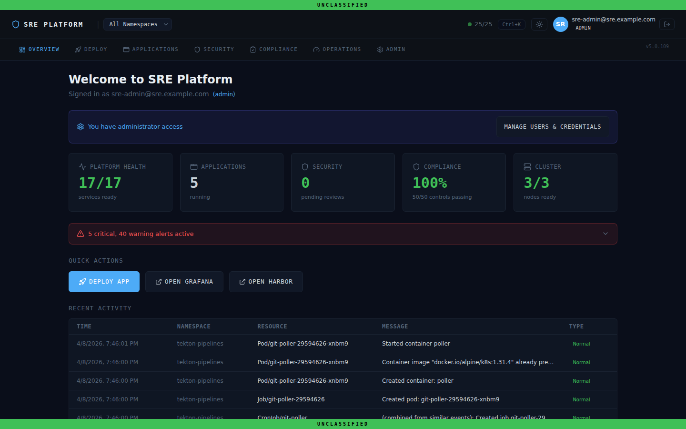

---

## Platform Tour

Everything is managed through the SRE Dashboard. The version number is displayed in the navigation bar.

### SSO Login

Visit any platform URL and you are redirected to sign in. One login grants access to every service.

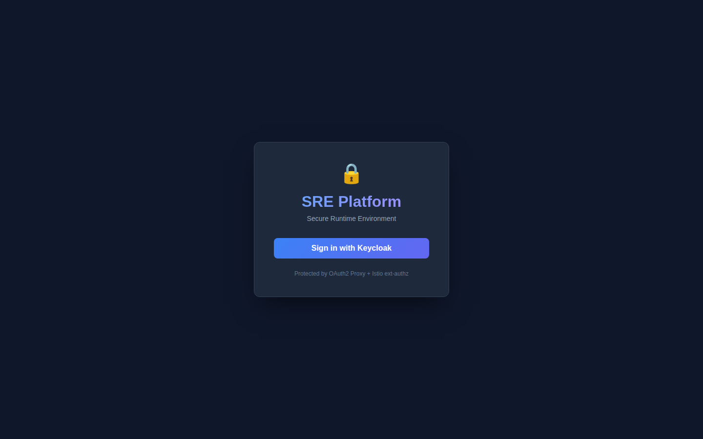

Enter your credentials (default: `sre-admin` / `SreAdmin123!`).


### Overview

The landing page after login. Shows cluster health, node status, component health, and problem pods at a glance.


### Deploy Applications

Submit container images through the DSOP security pipeline. The **Developer Kit** (`tools/developer-kit/START-HERE.md`) is the primary path for deploying apps -- fill out a `bundle.yaml`, upload it, and the platform handles scanning, signing, and deployment.

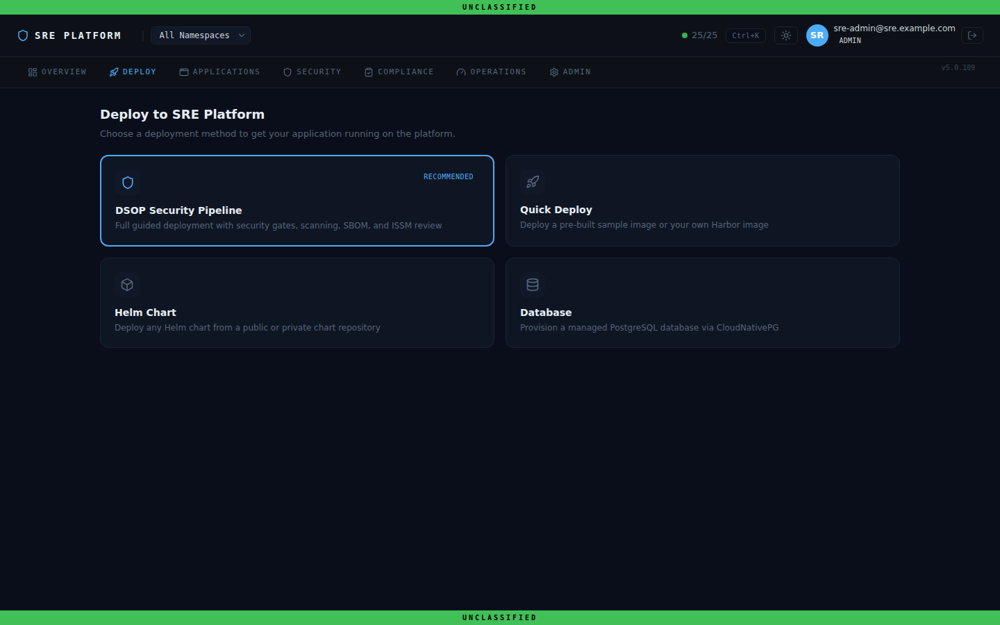

### Monitor Applications

View all deployed applications with health status, resource usage, and direct links.

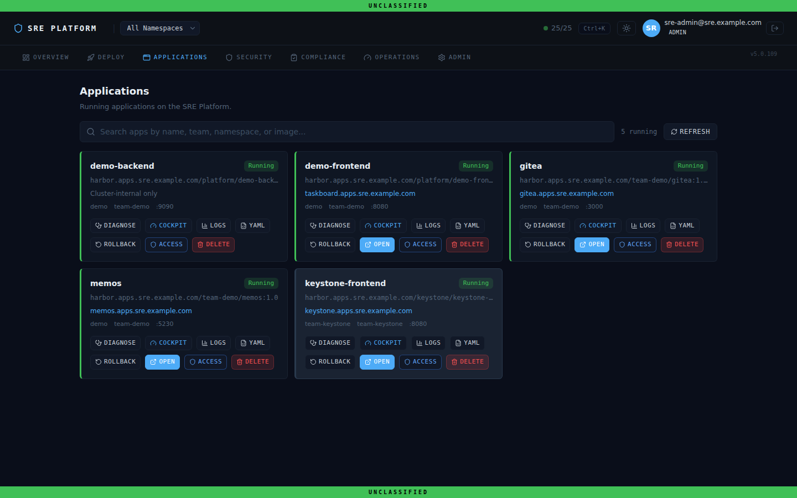

### Security and Pipeline

Track DSOP pipeline runs, ISSM review status, and platform security posture. Every image passes through all 8 RAISE 2.0 gates before it can run.

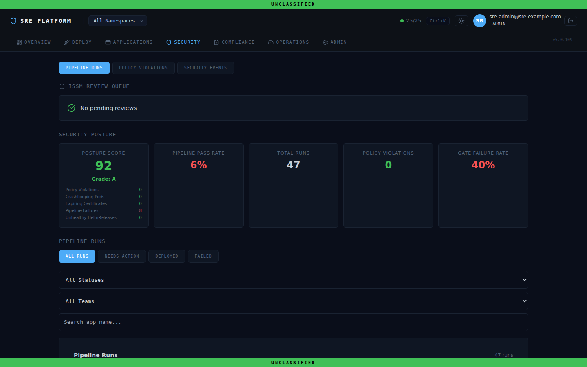

### Operations

Health checks, node status, pod inventory, and service discovery. Everything you need for day-2 operations without touching `kubectl`.

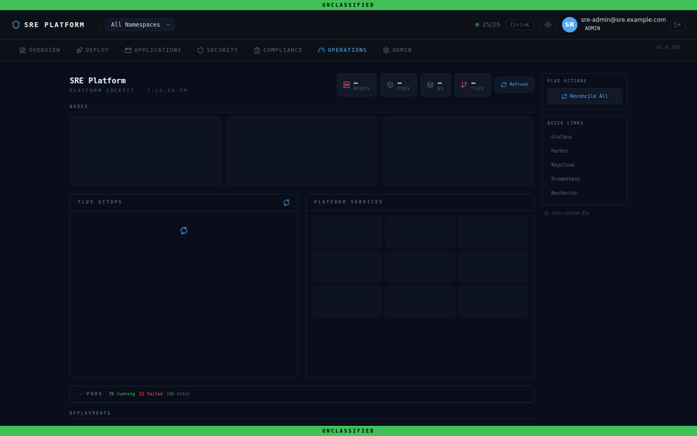

### Compliance

Live NIST 800-53 control coverage, compliance reports, and framework status. Maps every platform component to the controls it satisfies.

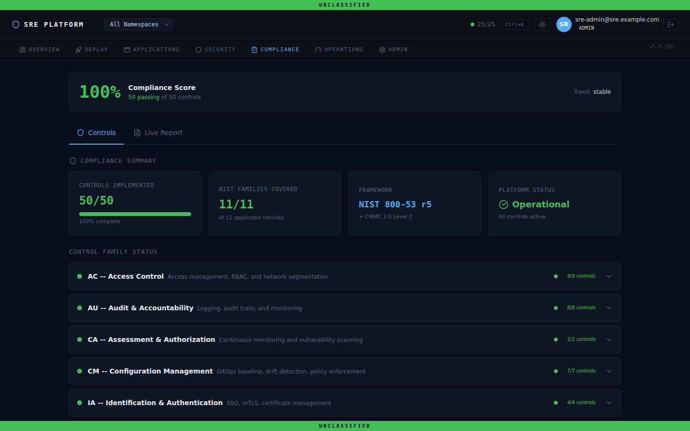

### Administration

Manage users, groups, tenants, secrets, SSO configuration, RBAC audit, and quick links to external services (Grafana, Harbor, NeuVector, Keycloak).

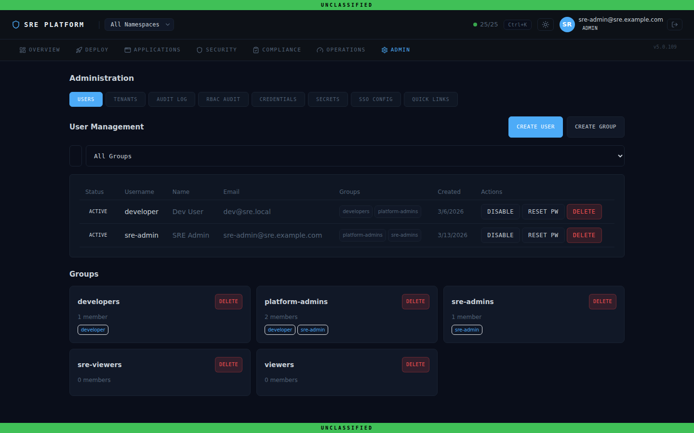

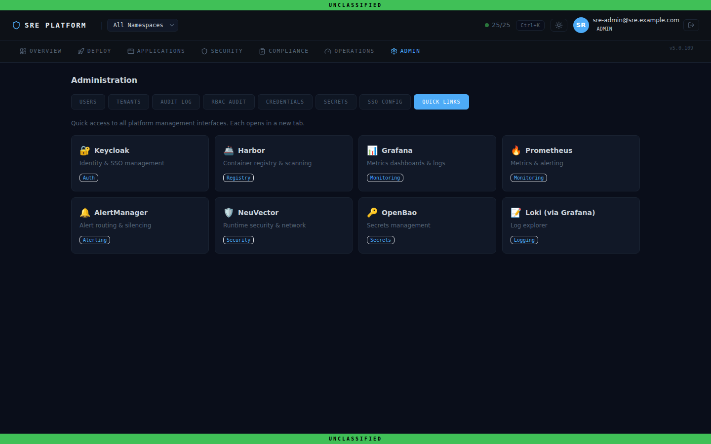

### Command Palette (Ctrl+K)

Quick-search to jump to any page, run live data queries, or open external services. Supports prefix shortcuts for filtering results.


---

## Quick Start

### Deploy to Any Existing Kubernetes Cluster

```bash
git clone https://github.com/morbidsteve/sre-platform.git
cd sre-platform
./scripts/sre-deploy.sh
```

The script handles storage provisioning, kernel modules, Flux CD bootstrap, secret generation, and waits until all components are healthy (~10 minutes).

When it finishes, open the dashboard URL printed in the output. All credentials and service URLs are available in the **Admin** tab.

### Deploy from Scratch on Proxmox VE

```bash
git clone https://github.com/morbidsteve/sre-platform.git
cd sre-platform
./scripts/quickstart-proxmox.sh
```

See the [Proxmox Getting Started Guide](docs/getting-started-proxmox.md) for details.

### Deploy on Cloud (AWS, Azure, vSphere)

```bash
git clone https://github.com/morbidsteve/sre-platform.git
cd sre-platform

# 1. Provision infrastructure
task infra-plan ENV=dev
task infra-apply ENV=dev

# 2. Harden OS + install RKE2
cd infrastructure/ansible
ansible-playbook playbooks/site.yml -i inventory/dev/hosts.yml

# 3. Deploy the platform
cd ../..
./scripts/sre-deploy.sh
```

---

## Deploy Your App

The **Developer Kit** is the primary path for getting your app on the platform. No Kubernetes knowledge required.

### 1. Read the guide

```
tools/developer-kit/START-HERE.md
```

### 2. Create a bundle

A bundle is your Docker image plus a short `bundle.yaml` config:

```yaml
apiVersion: sre.io/v1alpha1
kind: DeploymentBundle
metadata:
  name: my-app
  version: "1.0.0"
  team: team-alpha
spec:
  app:
    image: images/my-app.tar
    port: 8080
    resources: small
    ingress: my-app.apps.sre.example.com
```

### 3. Submit through the dashboard

Open the **Deploy** tab, upload your bundle, and the platform handles everything: vulnerability scanning, secret detection, compliance checks, image signing, and deployment.

The Developer Kit includes 7 working examples covering web apps, databases, multi-container setups, vendor software, and fullstack apps. See `tools/developer-kit/examples/` for the complete set.

### Container Requirements

Your container must:
- Run as **non-root** (UID 1000+)
- Listen on port **8080+** (not 80 or 443)
- Use a **pinned version tag** (not `:latest`)

---

## Architecture

SRE is composed of four layers:

```
+-------------------------------------------------+
|  Layer 4: Supply Chain Security                  |
|  Harbor + Trivy scanning + Cosign signing        |
|  + Kyverno image verification                    |
+-------------------------------------------------+
|  Layer 3: Developer Experience                   |
|  Helm templates + Tenant namespaces              |
|  + SRE Dashboard + GitOps app deployment         |
+-------------------------------------------------+
|  Layer 2: Platform Services (Flux CD)            |
|  Istio + Kyverno + Prometheus + Grafana + Loki   |
|  + NeuVector + OpenBao + cert-manager + Keycloak |
|  + Tempo + Velero + External Secrets             |
+-------------------------------------------------+
|  Layer 1: Cluster Foundation                     |
|  RKE2 (FIPS + CIS + STIG) on Rocky Linux 9      |
|  Provisioned by OpenTofu + Ansible + Packer      |
+-------------------------------------------------+
```

**Layer 1 -- Cluster Foundation:** Infrastructure provisioned with OpenTofu (AWS, Azure, vSphere, Proxmox VE), OS hardened to DISA STIG via Ansible, RKE2 installed with FIPS 140-2 and CIS benchmark.

**Layer 2 -- Platform Services:** All security, observability, and networking tools deployed via Flux CD. Every component is a HelmRelease in Git, continuously reconciled to the cluster.

**Layer 3 -- Developer Experience:** Standardized Helm chart templates and self-service tenant namespaces. Developers deploy apps by submitting a bundle through the dashboard -- the platform handles security contexts, network policies, monitoring, and mesh integration.

**Layer 4 -- Supply Chain Security:** Images scanned by Trivy, signed with Cosign, verified by Kyverno at admission, monitored at runtime by NeuVector.

### Security Controls

Every request passes through multiple security layers:

```
Request -> TLS Termination -> JWT Validation -> Authorization Policy -> Network Policy -> Istio mTLS -> Application
                                                                                              |
                                                                                   NeuVector Runtime Monitor
```

### Zero-Trust Security Model

Every layer enforces security independently -- compromising one layer does not bypass the others:

| Layer | Control | What It Prevents |
|-------|---------|-----------------|
| **Gateway** | Istio ext-authz + OAuth2 Proxy | Unauthenticated access to any service |
| **Mesh** | Istio mTLS STRICT | Unencrypted pod-to-pod communication |
| **Network** | NetworkPolicy default-deny | Lateral movement between namespaces |
| **Admission** | Kyverno 20 policies | Privileged containers, unsigned images, `:latest` tags, missing labels/probes |
| **Runtime** | NeuVector | Anomalous process execution, network exfiltration |
| **Secrets** | OpenBao + ESO | Hardcoded credentials, secret sprawl |
| **Audit** | Prometheus + Loki + Tempo | Unmonitored activity, missing forensic data |

### GitOps Flow

All changes flow through Git:

```
Developer -> git push -> GitHub -> Flux CD detects change -> Kyverno validates -> Helm deploys -> Pod running
```

No `kubectl apply` needed. No manual cluster access. Git is the single source of truth.

---

## Platform Components

### Component Versions (as deployed)

| Component | Chart Version | Namespace |
|-----------|:------------:|-----------|
| Istio (base + istiod + gateway) | 1.25.2 | istio-system |
| cert-manager | v1.14.4 | cert-manager |
| Kyverno | 3.3.7 | kyverno |
| kube-prometheus-stack | 72.6.2 | monitoring |
| Loki | 6.29.0 | logging |
| Alloy | 0.12.2 | logging |
| Tempo | 1.18.2 | tempo |
| OpenBao | 0.9.0 | openbao |
| External Secrets | 0.9.13 | external-secrets |
| NeuVector | 2.8.6 | neuvector |
| Velero | 11.3.2 | velero |
| Harbor | 1.16.3 | harbor |
| Keycloak | 24.8.1 | keycloak |
| MetalLB | 0.14.9 | metallb-system |

### Policy Enforcement (20 Kyverno ClusterPolicies)

All 20 policies are in **Enforce** mode, organized into three tiers aligned with Kubernetes Pod Security Standards and SRE-specific requirements.

**Baseline Tier** (4 policies) -- Applied cluster-wide. Prevents known privilege escalation vectors.

| Policy | What It Enforces |
|--------|-----------------|
| `disallow-privileged` | Blocks privileged containers |
| `disallow-host-namespaces` | Blocks hostPID, hostIPC, hostNetwork |
| `disallow-host-ports` | Blocks hostPort mappings |
| `restrict-sysctls` | Restricts unsafe sysctl settings |

**Restricted Tier** (4 policies) -- Applied to all tenant namespaces. Enforces hardened pod security.

| Policy | What It Enforces |
|--------|-----------------|
| `require-run-as-nonroot` | Requires non-root user |
| `require-drop-all-capabilities` | Requires `drop: ALL` capabilities |
| `disallow-privilege-escalation` | Blocks `allowPrivilegeEscalation: true` |
| `restrict-volume-types` | Limits volume types to safe list |

**Custom Tier** (12 policies) -- SRE-specific operational and supply chain policies.

| Policy | What It Enforces |
|--------|-----------------|
| `disallow-latest-tag` | Blocks `:latest` image tags |
| `require-labels` | Requires `app.kubernetes.io/name` and `sre.io/team` labels |
| `require-network-policies` | Ensures every namespace has a default-deny NetworkPolicy |
| `require-security-context` | Requires non-root, read-only rootfs, drop ALL capabilities |
| `restrict-image-registries` | Restricts images to approved registries |
| `require-istio-sidecar` | Requires Istio sidecar injection labels on namespaces |
| `require-probes` | Requires liveness and readiness probes |
| `require-resource-limits` | Requires CPU and memory resource limits |
| `require-security-categorization` | Requires security classification labels |
| `verify-image-signatures` | Verifies Cosign signatures on container images |

### Security Gates (RAISE 2.0)

Every container image passes through all 8 RAISE 2.0 security gates before it can run on the platform:

| Gate | Tool | NIST Control | Fail Criteria |
|------|------|:------------:|---------------|
| **GATE 1:** SAST | Semgrep | SA-11 | ERROR-level findings |
| **GATE 2:** SBOM | Syft (SPDX + CycloneDX) | CM-2 | Generation failure |
| **GATE 3:** Secrets Scan | Gitleaks | IA-5 | Any secret detected |
| **GATE 4:** Container Scan | Trivy | RA-5 | CRITICAL findings |
| **GATE 5:** DAST | OWASP ZAP | SA-11 | HIGH-risk alerts |
| **GATE 6:** ISSM Review | GitHub Environment | CA-2 | ISSM rejects |
| **GATE 7:** Image Signing | Cosign + SLSA Provenance | SI-7 | Signing failure |
| **GATE 8:** Artifact Storage | Harbor | CM-8 | Push failure |

---

## External Services

The dashboard provides quick links to all external services in the **Admin** tab. Each service is also accessible directly:

| Service | URL |
|---------|-----|
| **Dashboard** | `https://dashboard.apps.sre.example.com` |
| **Grafana** | `https://grafana.apps.sre.example.com` |
| **Harbor** | `https://harbor.apps.sre.example.com` |
| **NeuVector** | `https://neuvector.apps.sre.example.com` |
| **Keycloak** | `https://keycloak.apps.sre.example.com` |

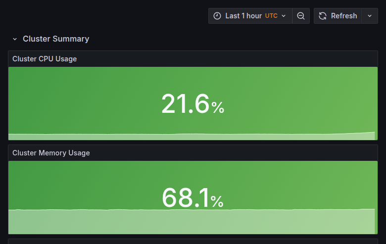

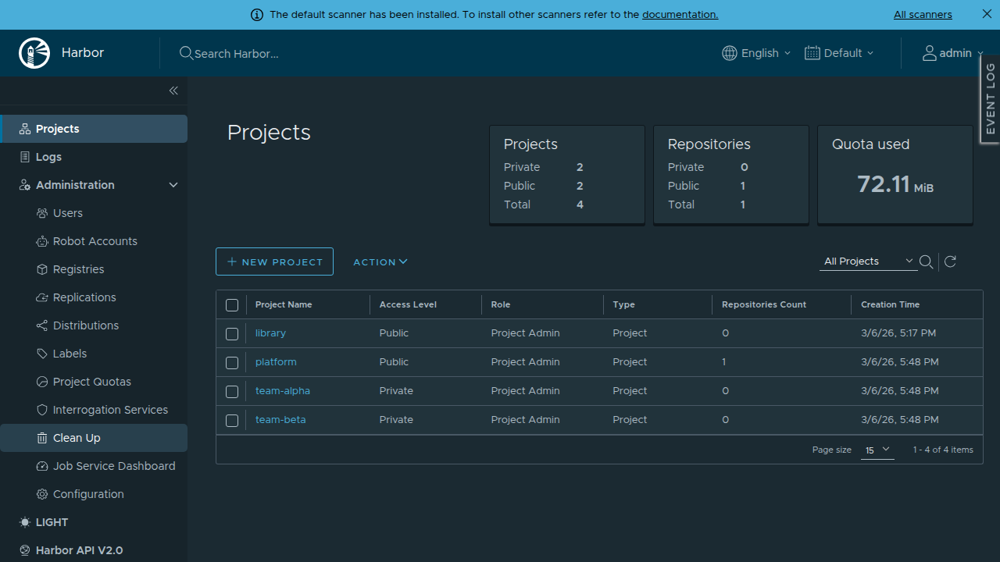

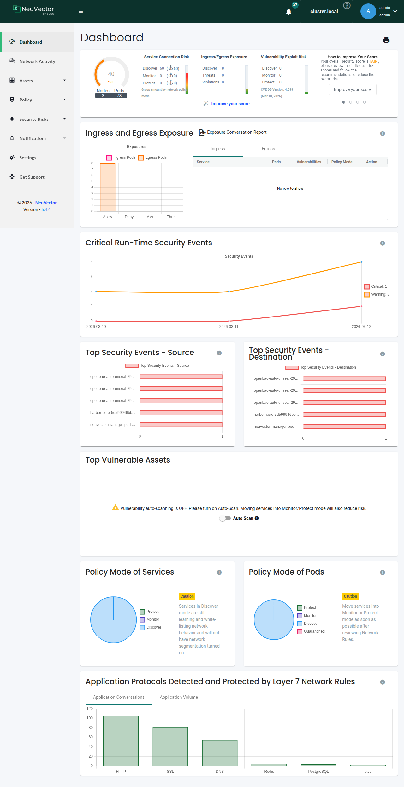

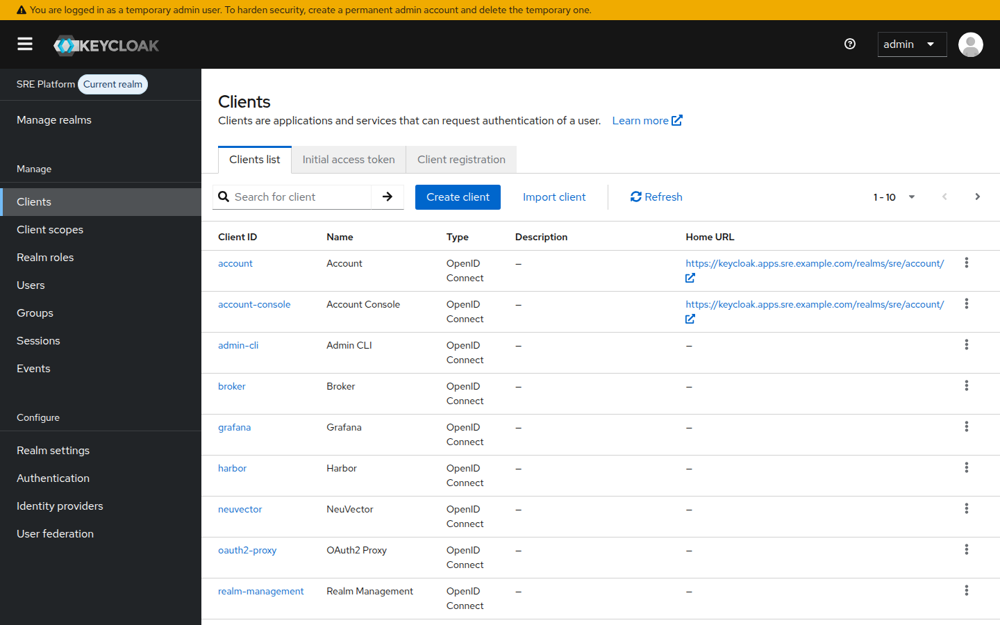

---

## Compliance

SRE ships with a complete compliance package ready for government assessment. Every Kyverno policy, Helm chart, and Flux manifest includes `sre.io/nist-controls` annotations mapping to specific NIST 800-53 controls.

### Framework Coverage

| Framework | Coverage | Status |
|-----------|----------|:------:|
| **NIST 800-53 Rev 5** | 49 controls across AC, AU, CA, CM, IA, IR, MP, RA, SA, SC, SI families | Complete |
| **CMMC 2.0 Level 2** | All 110 NIST 800-171 controls | Complete |
| **DISA STIGs** | RKE2 Kubernetes, RHEL 9 / Rocky Linux 9, Istio | Complete |
| **RAISE 2.0** | All 8 security gates enforced in CI/CD | Complete |
| **FedRAMP** | NIST 800-53 control inheritance + OSCAL artifacts | Complete |
| **CIS Benchmarks** | Kubernetes (via RKE2), Rocky Linux 9 Level 2 | Complete |

### Compliance Artifacts

| Artifact | Path | Description |
|----------|------|-------------|
| OSCAL System Security Plan | `compliance/oscal/ssp.json` | Machine-readable SSP in OSCAL format |
| NIST 800-53 Control Mapping | `compliance/nist-800-53-mappings/control-mapping.json` | 49 controls mapped to platform components |
| CMMC 2.0 Level 2 Assessment | `compliance/cmmc/level2-assessment.json` | Self-assessment with implementation evidence |
| RKE2 DISA STIG Checklist | `compliance/stig-checklists/rke2-stig.json` | Pre-filled with SRE implementation status |
| Rocky Linux 9 STIG Checklist | `compliance/stig-checklists/rocky-linux-9.yaml` | OS-level STIG compliance |
| Incident Response Runbooks | `docs/runbooks/` | 11 runbooks linked from AlertManager alerts |

---

## Networking

All platform UIs are exposed through a single Istio ingress gateway on standard HTTPS (port 443):

```
                    Internet / LAN
                         |
                  +------v------+
                  | LoadBalancer |  Dedicated IP (MetalLB / cloud LB)
                  |  :443 :80   |  Standard HTTPS/HTTP ports
                  +------+------+
                         |
                +--------v--------+
                |  Istio Gateway  |  TLS termination
                |  (istio-system) |  Host-based routing
                +--------+--------+
                         |
         +---------------+---------------+
         |               |               |
    +----v----+    +----v----+    +----v----+
    | Grafana |    | Harbor  |    | Your App|
    | :3000   |    | :8080   |    | :8080   |
    +---------+    +---------+    +---------+
```

All URLs follow the pattern `https://<service>.apps.sre.example.com`. SSO is enforced via Keycloak + OAuth2 Proxy + Istio ext-authz -- log in once and you are authenticated across every service.

---

## Project Structure

```
sre-platform/
├── platform/                     # Flux CD GitOps manifests
│   ├── flux-system/              # Flux bootstrap
│   ├── core/                     # Core platform components
│   │   ├── istio/                # Service mesh (mTLS, gateway, auth)
│   │   ├── cert-manager/         # TLS certificates
│   │   ├── kyverno/              # Policy engine
│   │   ├── monitoring/           # Prometheus + Grafana + Alertmanager
│   │   ├── logging/              # Loki + Alloy
│   │   ├── tracing/              # Tempo
│   │   ├── openbao/              # Secrets vault
│   │   ├── external-secrets/     # Secrets sync to K8s
│   │   ├── runtime-security/     # NeuVector
│   │   └── backup/               # Velero
│   └── addons/                   # Optional components
│       ├── harbor/               # Container registry
│       └── keycloak/             # Identity / SSO
├── apps/
│   ├── dashboard/                # SRE Dashboard (React 18 / TypeScript / Tailwind)
│   ├── dsop-wizard/              # DSOP deployment wizard (React / TypeScript / Tailwind)
│   ├── portal/                   # SRE Portal landing page
│   ├── demo-fullstack/           # Fullstack demo application
│   ├── templates/                # Helm chart templates (web-app, worker, cronjob, api)
│   └── tenants/                  # Per-team app deployment configs
├── tools/
│   └── developer-kit/            # Bundle templates, examples, and START-HERE guide
├── ci/
│   ├── github-actions/           # Reusable GitHub Actions (all 8 RAISE 2.0 gates)
│   └── gitlab-ci/                # Reusable GitLab CI (all 8 RAISE 2.0 gates)
├── policies/                     # 20 Kyverno policies (baseline/restricted/custom) + test suites
├── infrastructure/
│   ├── tofu/                     # OpenTofu modules (AWS, Azure, vSphere, Proxmox)
│   ├── ansible/                  # OS hardening + RKE2 install
│   └── packer/                   # Immutable VM image builds
├── compliance/                   # OSCAL SSP, STIG checklists, NIST mappings, CMMC assessment
├── scripts/                      # Deploy and management scripts
└── docs/                         # Full documentation
```

---

## Documentation

| Guide | Description |
|-------|-------------|
| [Architecture](docs/architecture.md) | Full platform spec and design rationale |
| [Decision Records](docs/decisions.md) | ADRs for all major technology choices |
| [Developer Guide](docs/developer-guide.md) | Deploy your app, secrets management, SSO, CI/CD |
| [Developer Kit](tools/developer-kit/START-HERE.md) | Bundle-based app deployment guide with examples |
| [Proxmox Guide](docs/getting-started-proxmox.md) | Build a cluster from scratch on Proxmox VE |
| [User Stories](docs/user-stories.md) | Personas, walkthroughs, and screenshots for every user type |
| [CI/CD Pipelines](ci/README.md) | RAISE 2.0 compliant GitHub Actions + GitLab CI pipelines |
| [Incident Runbooks](docs/runbooks/) | 11 runbooks for common platform incidents |
| [Session Playbook](docs/session-playbook.md) | Historical step-by-step build plan |

---

## Contributing

**Branch naming:** `feat/`, `fix/`, `docs/`, `refactor/` prefixes

**Commit format:** [Conventional Commits](https://www.conventionalcommits.org/) -- `feat(istio): add strict mTLS peer authentication`

**Requirements:**
- `task lint` and `task validate` must pass
- Every component needs a `README.md`
- All Kyverno policies need test suites
- All Helm charts need `values.schema.json`
- Never use `:latest` tags -- pin specific versions
- Never commit secrets or credentials

---

## License

Apache License, Version 2.0. See [LICENSE](LICENSE).
