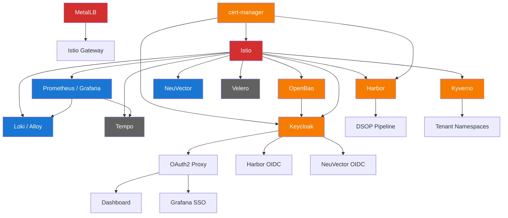

# Component Dependencies

This document maps the dependency relationships and blast radius of all SRE platform components.

## Dependency Chain

## Component Details

### Critical (Platform-Wide Outage)

| Component | Namespace | Impact if Down | Depends On | Depended On By |
|-----------|-----------|----------------|------------|----------------|
| **MetalLB** | metallb-system | LoadBalancer services lose external IPs. Istio gateway unreachable. All external traffic blocked. | None | Istio gateway, all external services |
| **Istio** | istio-system | All mTLS, ingress, and service-to-service communication stops. All external traffic blocked. | cert-manager | All apps, Keycloak, Grafana, Harbor, NeuVector, OpenBao, Dashboard |

### High (Major Feature Loss)

| Component | Namespace | Impact if Down | Depends On | Depended On By |
|-----------|-----------|----------------|------------|----------------|
| **cert-manager** | cert-manager | TLS certificate issuance stops. Istio and ingress may lose certificates on rotation. | None | Istio, Harbor, Keycloak, OpenBao |
| **Kyverno** | kyverno | Policy enforcement stops. New pods deploy without security validation. Image signature checks disabled. | Istio, cert-manager | All tenant namespaces |
| **Keycloak** | keycloak | SSO for all platform UIs stops. Users cannot log in to Grafana, Harbor, Dashboard. | Istio, cert-manager, OpenBao | OAuth2 Proxy, Grafana SSO, Harbor OIDC, Dashboard SSO |
| **OpenBao** | openbao | Secret delivery stops. ESO cannot sync. New deployments needing secrets fail. | Istio | External Secrets Operator, Keycloak DB creds, apps using secrets |
| **Harbor** | harbor | Image pulls from internal registry fail. CI/CD pipelines cannot push. New deployments blocked. | Istio, cert-manager | All Harbor-image deployments, DSOP Pipeline builds |

### Medium (Feature Degradation)

| Component | Namespace | Impact if Down | Depends On | Depended On By |
|-----------|-----------|----------------|------------|----------------|
| **Prometheus / Grafana** | monitoring | Monitoring and alerting stops. No visibility into cluster health. Dashboards unavailable. | Istio | AlertManager, Grafana dashboards, SRE Dashboard metrics |
| **Loki / Alloy** | logging | Log aggregation stops. Historical logs unavailable. Audit trail gaps for compliance. | Istio, Prometheus | Grafana log dashboards, audit compliance |
| **NeuVector** | neuvector | Runtime security monitoring stops. No behavioral analysis. Network DLP/WAF disabled. | Istio | Security dashboards, compliance runtime controls |

### Low (Minimal Impact)

| Component | Namespace | Impact if Down | Depends On | Depended On By |
|-----------|-----------|----------------|------------|----------------|
| **Velero** | velero | Backup and DR unavailable. No new backups. Existing backups remain in storage. | Istio | None |
| **Tempo** | tempo | Distributed tracing stops. No new traces. Existing traces remain queryable. | Istio, Prometheus | Grafana trace dashboards |

## Recovery Priority Order

When recovering from a full outage, restore components in this order:

1. **MetalLB** - External IP assignment
2. **cert-manager** - TLS certificates
3. **Istio** - Service mesh and ingress
4. **Kyverno** - Policy enforcement
5. **Prometheus / Grafana** - Monitoring
6. **OpenBao** - Secrets
7. **Keycloak** - Authentication
8. **Harbor** - Container registry
9. **Loki / Alloy** - Logging
10. **NeuVector** - Runtime security
11. **Tempo** - Tracing
12. **Velero** - Backup

This order matches the Flux `dependsOn` chain and ensures each component has its dependencies available before starting.
