# SRE Platform Diagrams

Visual reference for the Secure Runtime Environment architecture, workflows, and security controls. All diagrams use [Mermaid](https://mermaid.js.org/) and render natively on GitHub.

---

## Table of Contents

1. [Platform Architecture](#platform-architecture)
2. [Infrastructure Deployment Pipeline](#infrastructure-deployment-pipeline)
3. [Developer Workflow](#developer-workflow)
4. [Request Flow and Security Chain](#request-flow-and-security-chain)
5. [Supply Chain Security](#supply-chain-security)
6. [Secrets Lifecycle](#secrets-lifecycle)
7. [Observability Architecture](#observability-architecture)
8. [Network Security Model](#network-security-model)
9. [GitOps Reconciliation](#gitops-reconciliation)
10. [NIST 800-53 Compliance Coverage](#nist-800-53-compliance-coverage)

---

## Platform Architecture

The full platform stack from infrastructure through application deployment.

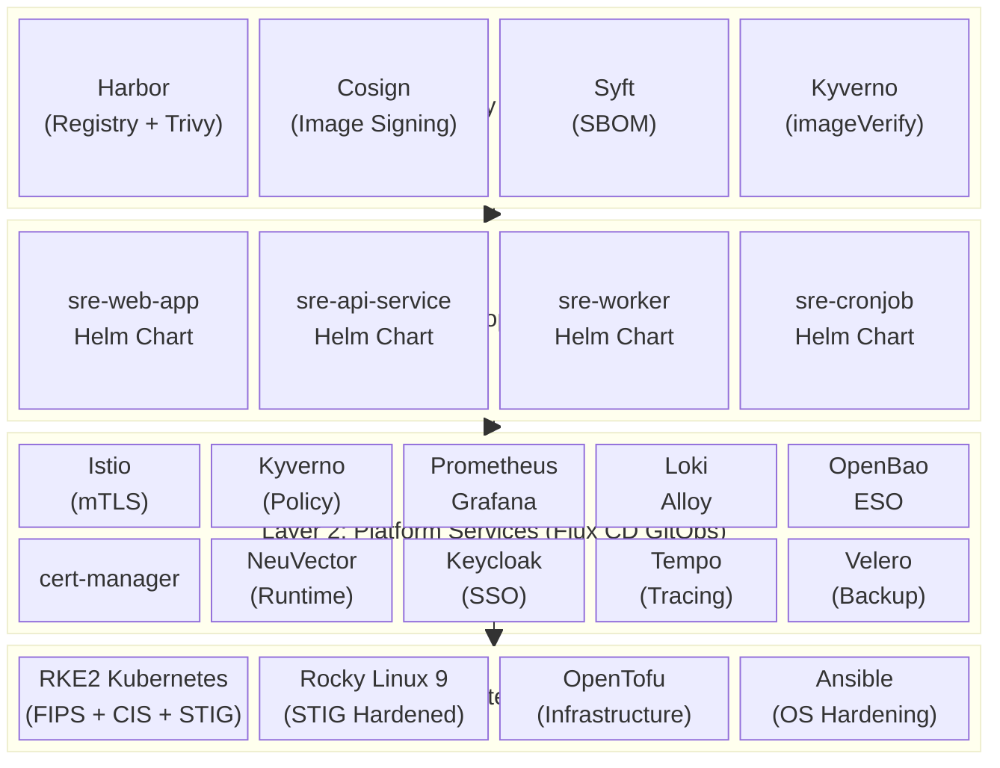

---

## Infrastructure Deployment Pipeline

How the platform goes from bare metal to a running, hardened Kubernetes cluster.

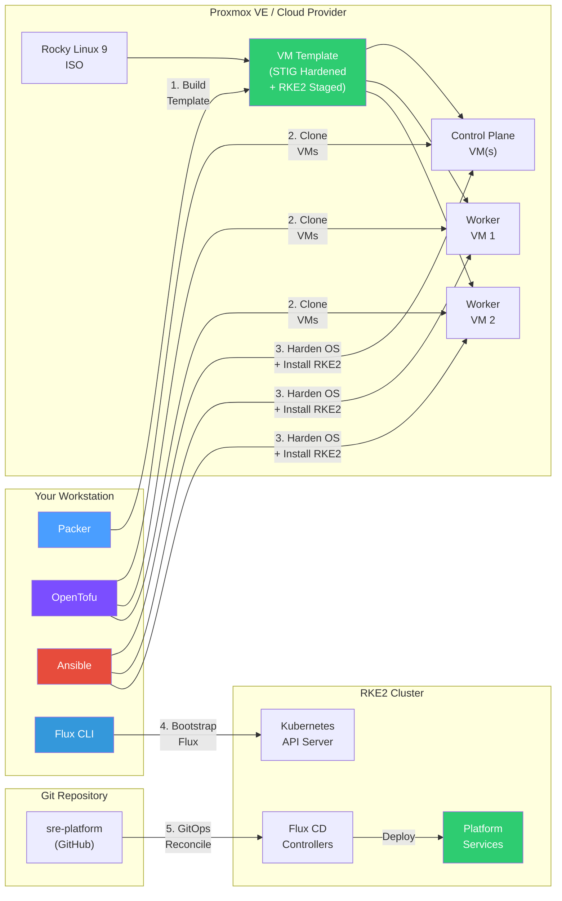

---

## Developer Workflow

How an application developer goes from code to running on the platform.

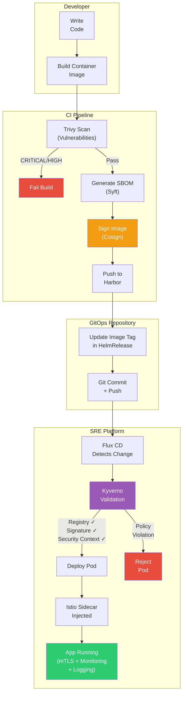

---

## Request Flow and Security Chain

Every request passes through multiple security layers before reaching your application.

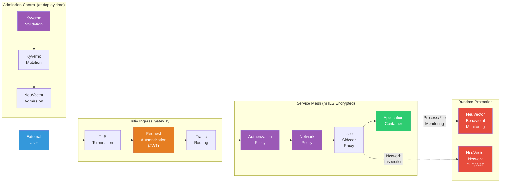

**Security controls applied at each stage:**

| Stage | Control | NIST |
|-------|---------|------|
| TLS Termination | Encrypted transport | SC-8 |
| Request Authentication | JWT/OIDC validation via Keycloak | IA-2, IA-8 |
| Authorization Policy | Fine-grained service-to-service RBAC | AC-3, AC-4 |
| Network Policy | Layer 3/4 traffic filtering | SC-7 |
| Istio mTLS | Encrypted pod-to-pod, SPIFFE identity | SC-8, IA-3 |
| Kyverno Validation | Image registry, signature, security context | CM-7, SI-7 |
| NeuVector Admission | Vulnerability threshold check | RA-5 |
| NeuVector Runtime | Behavioral anomaly detection, DLP/WAF | SI-3, SI-4 |

---

## Supply Chain Security

End-to-end image integrity from source code to running container.

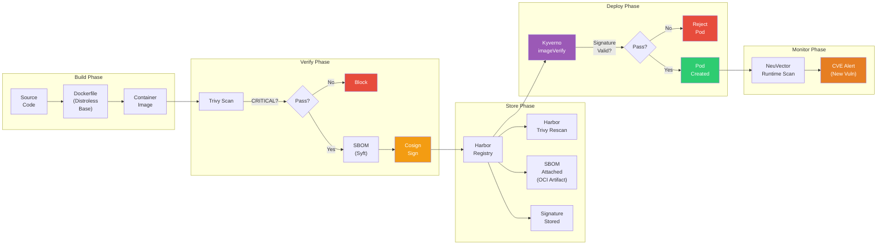

**What this prevents:**
- Untrusted images (registry restriction to `harbor.sre.internal` only)
- Unscanned images (Trivy gate in CI + Harbor rescan on push)
- Tampered images (Cosign cryptographic signature verified by Kyverno)
- Unknown dependencies (SBOM generated and attached as OCI artifact)
- Runtime vulnerabilities (NeuVector continuous scanning for new CVEs)
- Unversioned deployments (`:latest` tag blocked by Kyverno policy)

---

## Secrets Lifecycle

How secrets flow from a secure vault to application environment variables without touching Git.

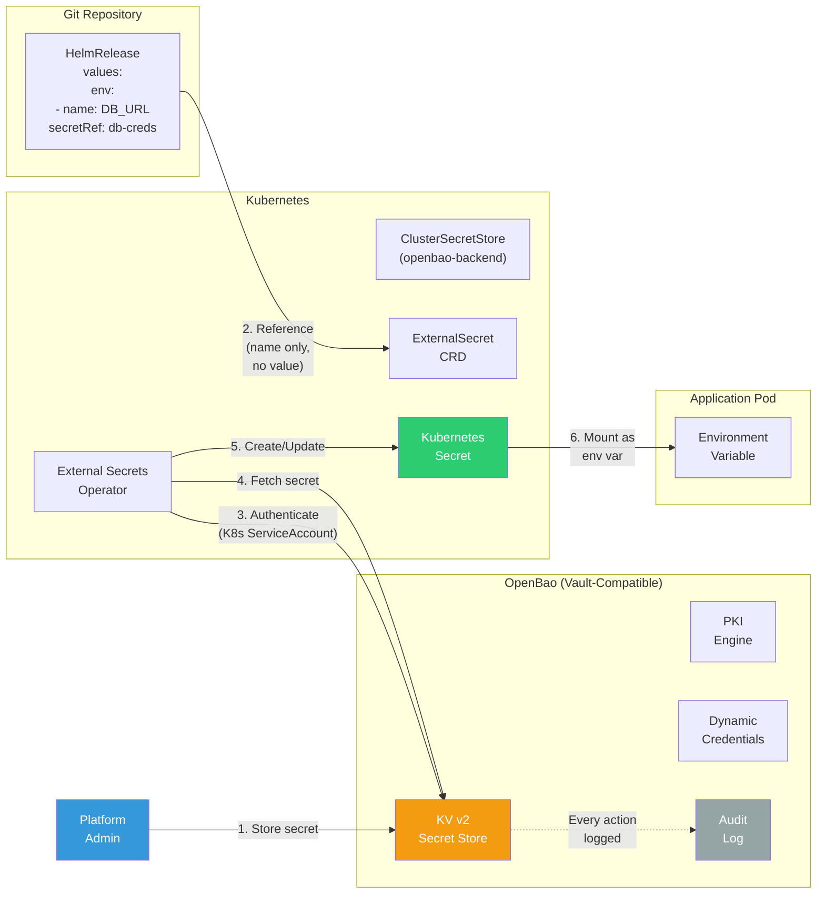

**Key properties:**
- Secrets never appear in Git (only the secret name is referenced)
- ESO refreshes secrets every hour (configurable)
- All OpenBao access is audit-logged (NIST AU-2)
- Pods authenticate to OpenBao via Kubernetes ServiceAccount (no hardcoded credentials)
- Dynamic database credentials auto-rotate and expire
- PKI engine issues short-lived certificates for internal services

---

## Observability Architecture

Unified metrics, logs, and traces through a single Grafana interface.

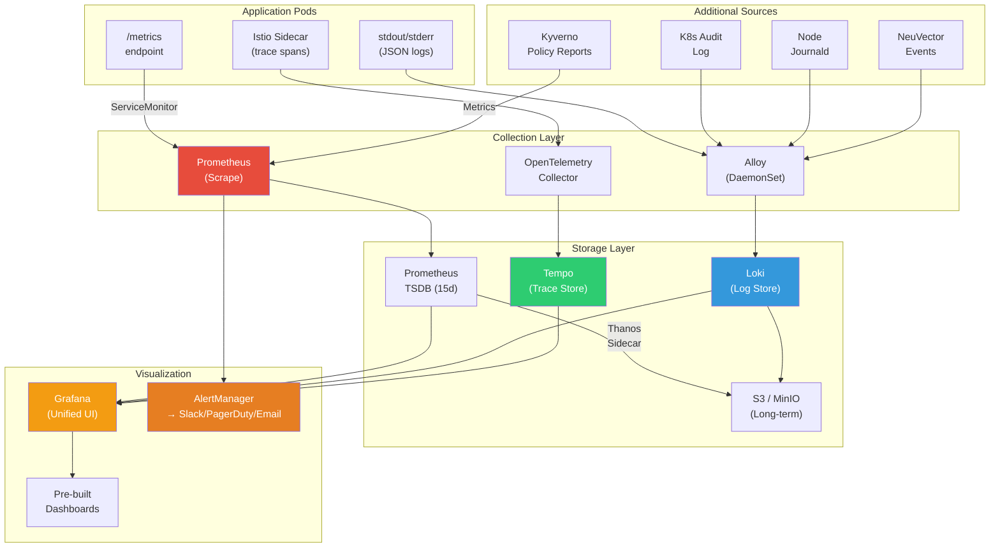

**Pre-built dashboards:**

| Dashboard | What It Shows |
|-----------|--------------|
| Cluster Health | Node CPU/memory/disk, pod counts, API server latency |
| Namespace Overview | Resource consumption per team namespace |
| Istio Traffic | Request rates, latencies, error rates per service |
| Kyverno Compliance | Policy pass/fail rates, violation trends |
| NeuVector Security | Runtime alerts, network violations, CIS scan results |
| Flux GitOps | Reconciliation status, drift detection, deployment history |
| Certificate Expiry | cert-manager certificate status and renewal timeline |

---

## Network Security Model

Zero-trust networking with defense in depth across multiple layers.

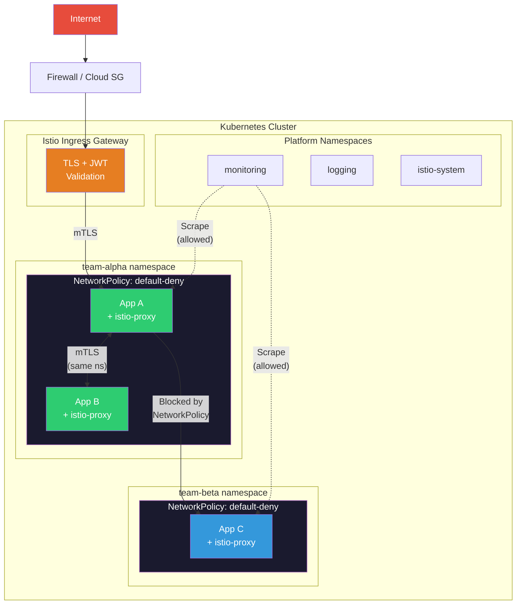

**Layers of network security:**

| Layer | Technology | What It Does |
|-------|-----------|--------------|
| Perimeter | Firewall / Security Groups | Restrict inbound to ports 443 (HTTPS) and 6443 (K8s API) |
| Ingress | Istio Gateway | TLS termination, JWT validation, rate limiting |
| Transport | Istio mTLS STRICT | All pod-to-pod traffic encrypted with SPIFFE identities |
| Segmentation | Kubernetes NetworkPolicy | Default deny-all per namespace, explicit allow rules |
| Authorization | Istio AuthorizationPolicy | Fine-grained service-to-service access control |
| Application | NeuVector DLP/WAF | Layer 7 inspection, PII detection, protocol validation |
| Egress | NetworkPolicy + Istio | Restrict outbound to approved destinations only |

---

## GitOps Reconciliation

How Flux CD continuously reconciles cluster state to match the Git repository.

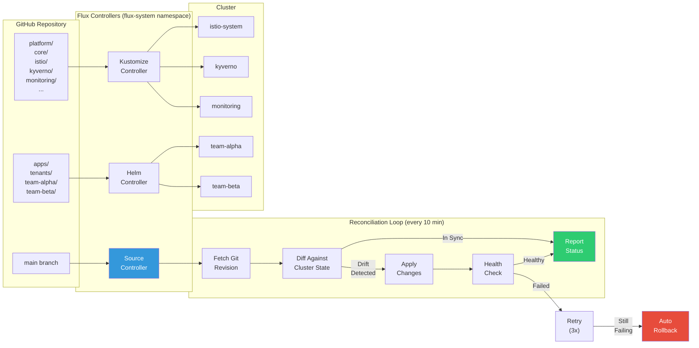

**GitOps guarantees:**
- Git is the single source of truth for all cluster state
- Manual `kubectl` changes are automatically reverted (drift correction)
- Every change is auditable via Git commit history
- Failed deployments auto-retry (3x) then rollback
- Dependency ordering ensures services deploy in the correct sequence

---

## NIST 800-53 Compliance Coverage

How platform components map to NIST 800-53 Rev 5 control families.

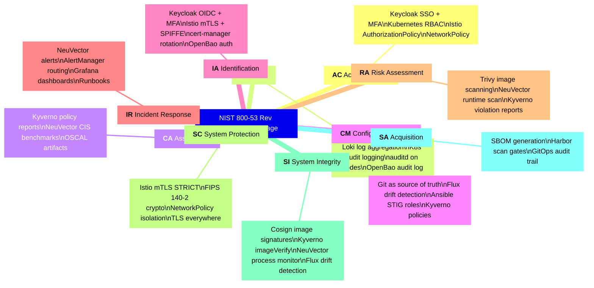

---

## Component Dependency Chain

The order in which platform services are deployed, and their dependencies.

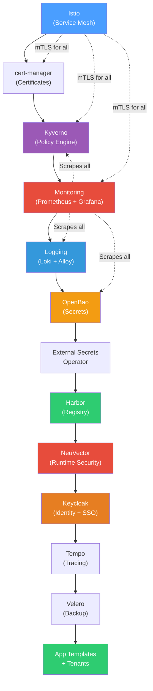

---

## Tenant Isolation Model

How multi-tenant workloads are isolated on the platform.

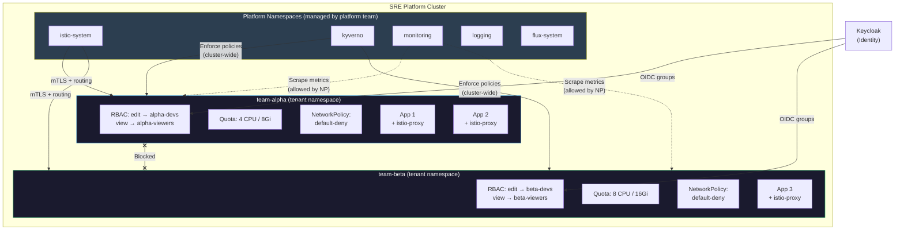

**Isolation boundaries per tenant:**

| Boundary | Mechanism | Effect |
|----------|-----------|--------|
| Identity | Keycloak groups → RBAC RoleBindings | Only team members can access their namespace |
| Resource | ResourceQuota + LimitRange | Prevent one team from consuming all cluster resources |
| Network | NetworkPolicy (default deny) | Cross-namespace traffic blocked unless explicitly allowed |
| Encryption | Istio mTLS (SPIFFE per pod) | Even if network policy fails, traffic is identity-verified |
| Policy | Kyverno (cluster-wide) | All tenants must meet the same security baseline |
| Registry | Kyverno imageVerify | Only signed images from approved registries |
| Secrets | OpenBao path-based ACLs | Each team can only access `sre/<team-name>/*` secrets |
