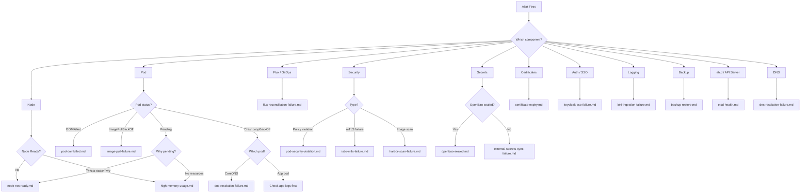

# SRE Platform On-Call Playbook

This document is for the on-call engineer responding to platform incidents. Keep it bookmarked. When your pager goes off at 3am, start here.

---

## First Response Checklist

When alerted, run these five commands immediately to get situational awareness:

```bash
# 1. Are all nodes healthy?
kubectl get nodes

# 2. Are there pods in bad states?
kubectl get pods -A --field-selector 'status.phase!=Running,status.phase!=Succeeded' | head -20

# 3. Are all Flux HelmReleases reconciled?
flux get helmreleases -A | grep -v "True"

# 4. Are any critical Prometheus alerts firing?
kubectl get --raw /api/v1/namespaces/monitoring/services/kube-prometheus-stack-alertmanager:9093/proxy/api/v2/alerts?active=true 2>/dev/null | python3 -m json.tool | head -50

# 5. Quick platform component status
kubectl get pods -n istio-system,kyverno,monitoring,logging,openbao,harbor,keycloak,external-secrets --no-headers | grep -v Running
```

---

## Decision Tree

Use this diagram to map symptoms to the correct runbook.



---

## Severity Matrix

| Severity | Definition | Response Time | Actions | Wake Someone? |
|----------|-----------|---------------|---------|---------------|
| **P1 - Critical** | Cluster down, data loss risk, all users affected | **15 minutes** | Acknowledge immediately. Start investigation. Page backup on-call if not resolved in 30 minutes. | **Yes** -- page backup on-call and team lead |
| **P2 - High** | Single platform component down, some users affected, security control degraded | **30 minutes** | Acknowledge. Investigate during waking hours. If after-hours, assess if it can wait until morning. | **Only if** security control is bypassed (e.g., Kyverno down, mTLS disabled) |
| **P3 - Medium** | Non-critical component degraded, workaround available, warning-level alert | **4 hours** | Acknowledge. Investigate next business day. Document in shift handoff. | **No** |

### P1 Scenarios (Always Wake)

- All nodes NotReady
- etcd lost quorum
- OpenBao sealed (secrets unavailable for new deployments)
- Istio mTLS disabled cluster-wide (SC-8 control violated)
- Kyverno admission controller down (all policy enforcement bypassed)
- CoreDNS down (all DNS resolution fails)
- API server unresponsive

### P2 Scenarios (Judgment Call)

- Single node NotReady (cluster still functional with remaining nodes)
- Harbor down (no new image pulls, existing pods unaffected)
- Flux reconciliation failing (drift not corrected, but cluster still running)
- Keycloak down (SSO broken, but existing sessions may still work)
- Certificate expiring in < 7 days
- Single ExternalSecret sync failure

### P3 Scenarios (Next Business Day)

- Kyverno policy violation in Audit mode
- Loki ingestion delayed but not lost
- Grafana dashboard errors
- Non-critical certificate expiring in < 30 days
- Velero backup partially failed

---

## Safe vs Dangerous Operations

| Operation | Safety | Notes |
|-----------|--------|-------|
| `kubectl get/describe/logs` | **Safe** | Read-only, always fine |
| `kubectl top nodes/pods` | **Safe** | Read-only metrics |
| `flux get/logs` | **Safe** | Read-only Flux status |
| `kubectl rollout restart deployment/X` | **Generally safe** | Triggers rolling restart, brief disruption |
| `kubectl delete pod X` | **Generally safe** | Pod is recreated by its controller |
| `flux reconcile` | **Safe** | Forces immediate GitOps sync |
| `flux suspend` | **Caution** | Stops GitOps reconciliation -- remember to resume |
| `kubectl scale deployment X --replicas=0` | **Caution** | Takes service offline -- verify impact first |
| `kubectl drain node` | **Caution** | Evicts all pods from node -- verify remaining capacity |
| `kubectl cordon node` | **Safe** | Prevents new scheduling, existing pods unaffected |
| `kubectl uncordon node` | **Safe** | Resumes scheduling on node |
| `kubectl edit/patch` | **Dangerous** | Direct mutation bypasses GitOps -- Flux will revert |
| `kubectl delete namespace` | **Dangerous** | Deletes ALL resources in namespace permanently |
| `kubectl delete pv/pvc` | **Dangerous** | Permanent data loss |
| `etcdctl member remove` | **Dangerous** | Can break quorum -- never do this without expert guidance |
| `rke2 server --cluster-reset` | **Dangerous** | Resets etcd to single node -- data loss for other members |
| `helm uninstall` | **Dangerous** | Removes release and all its resources |

---

## Escalation Contacts

| Role | Name | Contact | When to Escalate |
|------|------|---------|-----------------|
| Primary On-Call | (current rotation) | PagerDuty | First responder |
| Backup On-Call | (current rotation) | PagerDuty | P1 not resolved in 30 min |
| Platform Team Lead | PLACEHOLDER | Slack: #sre-escalation | P1 > 1 hour, any data loss risk |
| Infrastructure Lead | PLACEHOLDER | Slack: #sre-escalation | Node/network/storage issues |
| Security Lead | PLACEHOLDER | Slack: #sre-security | Policy bypass, unauthorized access |
| Application Teams | (per namespace owner) | Slack: team-specific channel | App-level issues after platform is healthy |

---

## Shift Handoff Template

Copy this template at the end of your on-call shift and post to #sre-handoff:

```
## On-Call Handoff — [DATE]

**Shift:** [START TIME] to [END TIME]
**On-Call Engineer:** [YOUR NAME]
**Incoming On-Call:** [NEXT ENGINEER]

### Incidents During Shift
- [INCIDENT 1]: [Brief description]. Status: [Resolved/Ongoing]. Runbook: [link].
- [INCIDENT 2]: ...

### Open Items (Action Required)
- [ ] [Item requiring follow-up and who should do it]
- [ ] [Item requiring follow-up]

### Platform Status at Handoff
- Nodes: [X/X Ready]
- HelmReleases: [X/X Healthy]
- Alerts firing: [list or "none"]
- OpenBao: [sealed/unsealed]
- Notable: [anything unusual the next person should know]

### Runbook Gaps Found
- [Any situation where the runbook was missing or incomplete]
```

---

## Quick Reference

### Credentials

- **Dashboard / Grafana / SSO**: sre-admin / SreAdmin123!
- **Keycloak Admin Console**: admin / (see openbao secret or bootstrap output)
- **Harbor**: admin / Harbor12345
- **NeuVector**: admin / admin
- **OpenBao Root Token**: `kubectl get secret -n openbao openbao-init-keys -o jsonpath='{.data.root_token}' | base64 -d`

### Key URLs

- Dashboard: https://dashboard.apps.sre.example.com
- Grafana: https://grafana.apps.sre.example.com
- Harbor: https://harbor.apps.sre.example.com
- Keycloak: https://keycloak.apps.sre.example.com
- NeuVector: https://neuvector.apps.sre.example.com

### Key Namespaces

| Namespace | Components |
|-----------|-----------|
| istio-system | Istio control plane, ingress gateway |
| kyverno | Policy engine |
| monitoring | Prometheus, Grafana, Alertmanager |
| logging | Loki, Alloy |
| openbao | Secrets management |
| external-secrets | External Secrets Operator |
| harbor | Container registry |
| keycloak | Identity provider |
| velero | Backup and restore |
| tempo | Distributed tracing |
| cert-manager | Certificate management |
| neuvector | Runtime security |

### Useful Aliases

Add these to your shell profile for faster incident response:

```bash
alias kgp='kubectl get pods -A --sort-by=.status.startTime'
alias kgn='kubectl get nodes -o wide'
alias kge='kubectl get events -A --sort-by=.lastTimestamp | tail -30'
alias fghr='flux get helmreleases -A'
alias fgks='flux get kustomizations -A'
alias kbad='kubectl get pods -A --field-selector status.phase!=Running,status.phase!=Succeeded'
```
