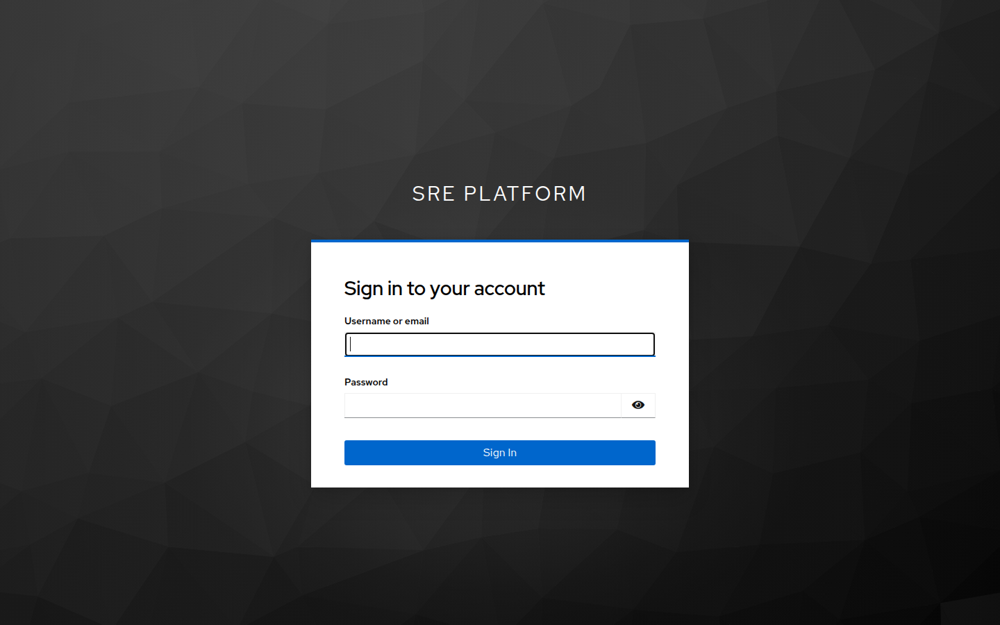
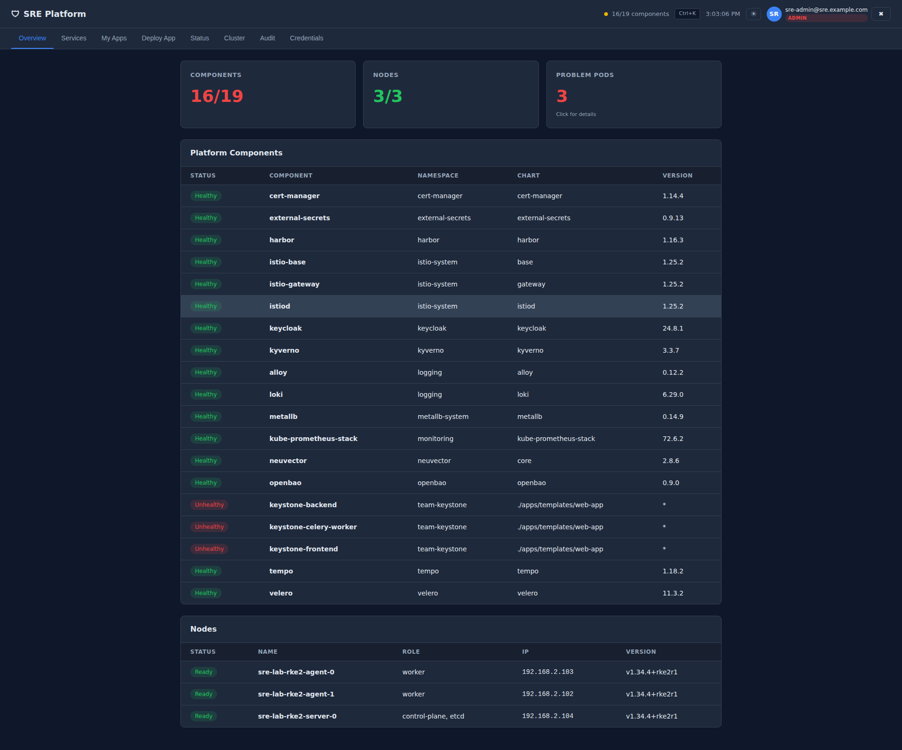

# SRE Platform Dashboard User Guide

This guide is for platform operators, team leads, and anyone who needs to deploy, monitor, or manage applications using the SRE Platform Dashboard. No knowledge of Kubernetes, Docker, or command-line tools is required.

---

## Table of Contents

1. [Getting Started](#1-getting-started)
2. [Dashboard Layout](#2-dashboard-layout)
3. [Overview Tab](#3-overview-tab)
4. [Services Tab](#4-services-tab)
5. [My Apps Tab](#5-my-apps-tab)
6. [Deploy App Tab](#6-deploy-app-tab)
7. [Status Tab](#7-status-tab)
8. [Cluster Tab](#8-cluster-tab)
9. [Audit Tab](#9-audit-tab)
10. [Credentials Tab](#10-credentials-tab)
11. [Common Tasks](#11-common-tasks)
12. [Troubleshooting](#12-troubleshooting)
13. [Glossary](#13-glossary)

---

## 1. Getting Started

### Dashboard URL

Open your web browser and navigate to:

```
https://dashboard.apps.sre.example.com
```

### Logging In

The dashboard uses Keycloak single sign-on (SSO). When you visit the dashboard for the first time, you will be redirected to the Keycloak login page.

1. Enter your username and password.
2. Complete any multi-factor authentication (MFA) prompts if required.
3. You will be redirected back to the dashboard.

Once logged in, your name and role appear in the top-right corner of the header.



### User Roles

Your access level depends on which Keycloak group you belong to:

| Role | Group | What You Can Do |
|------|-------|-----------------|
| **Admin** | `sre-admins` | Full access to all features, including credentials, quick actions, and pod deletion |
| **Developer** | `developers` | Deploy applications, view cluster status, view logs, and manage your own apps |

If you do not see a feature described in this guide, your account may not have the required permissions. Contact your platform administrator to request access.

### DNS Setup

If this is your first time accessing platform services, you may need to add a DNS entry to your computer so your browser can reach the services by hostname. The dashboard shows the required entry on the **Services** tab under the "DNS Setup" section. Copy the line shown there and add it to your computer's `/etc/hosts` file, or ask your IT team to configure DNS for you.

---

## 2. Dashboard Layout

The dashboard has three main areas:

- **Header bar** (top): Shows the platform name, a command palette shortcut, a light/dark theme toggle, and your user information.
- **Tab bar** (below the header): The main navigation. Click a tab name to switch between sections.
- **Main content area**: Displays the content of the selected tab.

### Theme Toggle

Click the theme button in the top-right corner of the header to switch between dark mode and light mode. Your preference is saved automatically.

### Command Palette

Click the keyboard shortcut hint in the header (or press `Ctrl+K` / `Cmd+K`) to open the command palette. Type to search for services, pages, or actions and press Enter to navigate directly. This is a quick way to jump to any part of the dashboard without clicking through tabs.

### Alert Banner

When the platform detects critical issues (such as unhealthy nodes or a high number of problem pods), a colored alert banner appears below the header. Click the banner to expand details. Click the dismiss button to hide it.

---

## 3. Overview Tab

The Overview tab is the first thing you see when you open the dashboard. It provides a quick health check of the entire platform.



### Summary Cards

Three cards at the top show key numbers at a glance:

- **Components**: The total number of platform services (called HelmReleases). A healthy platform shows all components in a normal state.
- **Nodes**: The number of servers (machines) in the cluster. All nodes should show a healthy status.
- **Problem Pods**: The number of application instances that are in a failed or unhealthy state. Ideally this number is zero. If it is greater than zero, the number appears in red.

### Problem Pods Detail Panel

If there are problem pods, click the **Problem Pods** card to expand a detail panel below the summary cards. This panel shows a table with the following columns:

| Column | Description |
|--------|-------------|
| **Status** | A colored indicator showing the pod's current state |
| **Pod** | The name of the pod (application instance) |
| **Namespace** | The workspace the pod belongs to |
| **Reason** | Why the pod is unhealthy (e.g., ImagePullBackOff, CrashLoopBackOff) |
| **Restarts** | How many times the pod has restarted |
| **Age** | How long ago the pod was created |
| **Actions** | Buttons to take action on the pod |

Each row in the problem pods table has two action buttons:

- **Logs**: Opens the log viewer with this pod pre-selected so you can see what went wrong.
- **Delete**: Removes the stuck pod. If the pod is managed by a deployment (most are), the platform will automatically create a new replacement pod. This is safe to use for clearing stuck pods.

Click any row to expand full details about that pod, including its containers, events, the node it is running on, and its IP address.


### Platform Components Table

Below the summary cards, a table lists every platform service with its current status:

| Column | Description |
|--------|-------------|
| **Status** | Green badge for Healthy, red badge for Unhealthy |
| **Component** | The name of the platform service |
| **Namespace** | The workspace the service runs in |
| **Chart** | The Helm chart used to deploy the service |
| **Version** | The currently deployed version |

### Nodes Table

The bottom table shows all cluster nodes (servers):

| Column | Description |
|--------|-------------|
| **Status** | Green for Ready, red for NotReady |
| **Name** | The hostname of the server |
| **Role** | The node's role in the cluster (e.g., control-plane, worker) |
| **IP** | The node's network address |
| **Version** | The Kubernetes version running on the node |

---

## 4. Services Tab

The Services tab shows all platform services as a grid of tiles. Each tile represents a service such as Grafana (monitoring dashboards), Harbor (container registry), Keycloak (identity management), and others.


### Service Tiles

Each tile displays:

- The service name
- A colored health dot: green means the service is reachable, red means it is down or unreachable
- A clickable link that opens the service in a new browser tab

### Favorites

Click the star on any service tile to mark it as a favorite. Favorited services appear at the top of the grid for quick access. Favorites are saved in your browser.

### DNS Setup

Below the service tiles, the **DNS Setup** section shows the `/etc/hosts` entry you need to add to your computer so that service hostnames resolve correctly. Click the entry to copy it to your clipboard.

---

## 5. My Apps Tab

The My Apps tab shows all applications that have been deployed to the platform by your team or other teams.

### Browsing Apps

Applications are displayed as tiles in a gallery view. Each tile shows the application name, team, namespace, and image.

### Searching and Filtering

Use the search box at the top to filter applications by name, team, or image. The count next to the search box shows how many applications match your search.

### App Details

Click any app tile to view its details, including the deployment configuration, status, and access URL.

### No Apps Yet

If no applications have been deployed, the page displays a "Go to Deploy" button that takes you directly to the Deploy App tab.


---

## 6. Deploy App Tab

The Deploy App tab is where you launch new applications on the platform. It offers several deployment modes, shown as cards at the top. Click a card to switch between modes.

### Quick Start

The fastest way to try the platform. Quick Start offers one-click sample applications:

1. Enter a **Team Name** (or leave the default "demo").
2. Click one of the sample app cards (such as nginx, httpbin, podinfo, or whoami).
3. The platform deploys the sample app automatically.

This is useful for testing that the platform is working correctly before deploying your own applications.


### Deploy from Git

This is the most common way to deploy an application. The platform clones your Git repository, auto-detects the project type, builds container images, and deploys everything.

**Step by step:**

1. Click the **Deploy from Git** card.
2. Enter the **Git Repository URL** (for example, `https://github.com/your-org/your-app`).
3. Enter the **Branch** you want to deploy (default is `main`).
4. Enter an **App Name** using lowercase letters, numbers, and hyphens only (for example, `my-web-app`).
5. Enter a **Team Name** using the same naming rules (for example, `my-team`). The platform will create a workspace called `team-<your-team-name>` for your application.
6. Click **Deploy**.

**What happens next:**

- The platform analyzes your repository (about 15 seconds). It detects whether the project uses Docker Compose, a Dockerfile, a Helm chart, or Kubernetes manifests.
- A banner appears showing the detected project type and the number of services found.
- The platform builds container images for each service (1-3 minutes per service). You can watch the build progress in real time.
- After the builds complete, the platform deploys all services automatically.
- Database services (PostgreSQL) and caching services (Redis) are provisioned automatically if your project needs them.
- The frontend service gets a public URL at `https://<app-name>.apps.sre.example.com`.

> **Tip:** If the analysis or build fails, check that your repository URL is correct and that the repository is publicly accessible (or that the platform has credentials to access it).


### Container Image

Use this mode to deploy a pre-built container image from any registry.

1. Click the **Container Image** card.
2. Enter the **image URL** (for example, `docker.io/library/nginx`).
3. Enter the **image tag** (for example, `1.25`).
4. Enter the **container port** your application listens on.
5. Enter a **team name**.
6. Click **Deploy**.

### Dockerfile

Use this mode to build and deploy from a Dockerfile without a Git repository.

1. Click the **Dockerfile** card.
2. Enter an **App Name** and **Team Name**.
3. Paste or write your Dockerfile content in the text area.
4. Set the **Container Port** your application listens on.
5. Click **Build & Deploy**.

The platform builds the image, pushes it to the internal registry, and deploys it.

### Helm Chart

Use this mode to deploy from a Helm chart repository.

1. Click the **Helm Chart** card.
2. Enter the **chart repository URL**, **chart name**, and **version**.
3. Configure any additional settings.
4. Click **Deploy**.

### Docker Compose

Use this mode if you have an existing `docker-compose.yml` file.

1. Click the **Docker Compose** card.
2. Paste the contents of your `docker-compose.yml` file.
3. Click **Deploy**.

The platform translates your Compose file into Kubernetes resources and deploys all services.

### Multi-Container

Use this mode to deploy multiple containers as a group when you do not have a Docker Compose file.

1. Click the **Multi-Container** card.
2. Add each container's image, port, and configuration.
3. Click **Deploy**.

### Database

Use this mode to deploy a managed PostgreSQL database instance.

1. Click the **Database** card.
2. Configure the database name, size, and team.
3. Click **Deploy**.

The platform provisions a PostgreSQL instance using CNPG (CloudNativePG) with automatic backups and high availability.

---

## 7. Status Tab

The Status tab shows the real-time health of every platform service. Each service appears as a card with an operational status (up or down). The page refreshes automatically.

A timestamp at the bottom shows when the status was last checked.


---

## 8. Cluster Tab

The Cluster tab provides deeper visibility into the platform infrastructure. It has its own sub-navigation bar with seven panels.

### Nodes

Shows each cluster node as a card with:

- Node name and status (Ready or NotReady)
- Roles (control-plane, worker)
- Resource usage (CPU and memory)
- Kubernetes version and operating system


### Pods

A searchable, filterable table of all running pods (application instances) across the cluster.

**How to use it:**

1. Use the **namespace dropdown** to filter pods by workspace.
2. Use the **status dropdown** to filter by pod state (Running, Pending, Failed, Succeeded, CrashLoop).
3. Use the **search box** to find pods by name.
4. Click any row to expand detailed information about that pod.

### Logs

A log viewer for reading the output of any container on the platform.

**How to view logs:**

1. Select a **namespace** from the first dropdown.
2. Select a **pod** from the second dropdown (the list updates based on the namespace you chose).
3. Optionally select a specific **container** (if the pod has more than one).
4. Choose how many lines to display (100, 300, 1000, or 5000).
5. Check the **Previous** checkbox if you want to see logs from the previous container instance (useful after a crash).
6. Click **Fetch Logs**.

The logs appear in a scrollable viewer below. Use the **search box** to highlight and filter specific text within the logs. Click **Download** to save the logs to a file.


### Events

Shows cluster events filtered by namespace and type.

1. Use the **namespace dropdown** to focus on a specific workspace.
2. Use the **type dropdown** to filter by Warning or Normal events.

Events are listed with their time, namespace, resource, reason, and message. Warning events often indicate problems that need attention.

### Namespaces

Shows all namespaces (workspaces) in the cluster as a grid of cards. Each card displays the namespace name, the number of pods running in it, and resource usage.

### Resources

Shows the top resource consumers across the cluster, ranked by CPU or memory usage.

1. Use the **sort dropdown** to rank by CPU or Memory.
2. Use the **limit dropdown** to show the top 20, 50, or 100 pods.

This is useful for finding applications that are using more resources than expected.

### Quick Actions

Provides three operational actions without needing command-line access:

**Restart Deployment:**
1. Select a namespace.
2. Select a deployment.
3. Click **Restart**.

This triggers a rolling restart, which replaces pods one at a time with no downtime. Use this when an application is behaving unexpectedly and you want to give it a fresh start.

**Scale Deployment:**
1. Select a namespace.
2. Select a deployment.
3. Enter the desired number of replicas (instances).
4. Click **Scale**.

Use this to increase capacity (scale up) or reduce resource usage (scale down).

**Cordon / Uncordon Node:**
1. Select a node.
2. Click **Cordon** to prevent new pods from being scheduled on the node (existing pods continue running).
3. Click **Uncordon** to allow scheduling again.

Use this before performing maintenance on a server.

---

## 9. Audit Tab

The Audit tab shows recent Kubernetes events across the cluster, acting as an activity log of what happened and when.

### Filtering Events

- Use the **All / Warnings / Normal** filter buttons to show specific event types.
- Use the **namespace dropdown** to focus on a specific workspace.

### Reading the Event Table

| Column | Description |
|--------|-------------|
| **Time** | When the event occurred |
| **Namespace** | The workspace where the event happened |
| **Resource** | The name of the affected resource (pod, deployment, etc.) |
| **Reason** | A short code for what happened (e.g., Pulled, Scheduled, Failed) |
| **Message** | A human-readable description of the event |
| **Type** | Normal (routine activity) or Warning (potential problem) |

### Pagination

If there are many events, use the **Prev** and **Next** buttons at the bottom to page through them. The event count and current page are shown between the buttons.


---

## 10. Credentials Tab

The Credentials tab provides access to platform service login information.

### SSO Credentials

At the top, you will find instructions for logging into all platform services using Keycloak SSO. Once you log in to any service through Keycloak, you are automatically authenticated to all other SSO-enabled services.

### Break-Glass Credentials

Below the SSO section, there is a collapsed "Break-glass credentials" section. Click it to expand. These are emergency local admin accounts for each platform service (Grafana, Harbor, Keycloak, etc.) that bypass SSO. They should only be used when Keycloak is down or during initial platform setup.

> **Note:** Access to credentials is rate-limited to 5 requests per minute for security reasons. If you see a "Too many requests" error, wait a minute and try again.

> **Note:** Only users in the `sre-admins` group can view break-glass credentials.


---

## 11. Common Tasks

### Deploying an Application from GitHub

This walkthrough covers the most common deployment scenario.

1. Open the dashboard and click the **Deploy App** tab.
2. Click the **Deploy from Git** card.
3. In the **Git Repository URL** field, enter your repository URL (for example, `https://github.com/your-org/your-app`).
4. Set the **Branch** to the branch you want to deploy (for example, `main`).
5. Enter an **App Name** (for example, `customer-portal`). Use only lowercase letters, numbers, and hyphens.
6. Enter your **Team Name** (for example, `frontend-team`).
7. Click **Deploy**.
8. Wait for the analysis phase (about 15 seconds). A banner will show the detected project type.
9. The build phase begins automatically. Watch the progress indicators for each service. Builds typically take 1-3 minutes per service.
10. Once all builds succeed, the platform deploys your services and creates an access URL.
11. Your application will be available at `https://<app-name>.apps.sre.example.com`.

> **Tip:** After deployment, go to the **My Apps** tab to see your application listed. Click the tile to verify it is running.

### Checking Why an Application Is Failing

1. Go to the **Overview** tab.
2. Look at the **Problem Pods** card. If the number is greater than zero, click the card to expand the detail panel.
3. Find your pod in the table. Look at the **Reason** column to understand the issue.
4. Click the row to expand full details, including events that describe what went wrong.
5. Click the **Logs** button in the Actions column to see the application's output.
6. Review the common reasons below to understand what the problem means and how to fix it.

**Common pod failure reasons:**

| Reason | What It Means | What to Do |
|--------|---------------|------------|
| **ImagePullBackOff** | The platform cannot download the container image. The image name may be wrong, the image may not exist, or authentication is required. | Verify the image name and tag are correct. Check that the image exists in the registry. |
| **CrashLoopBackOff** | The application starts but crashes immediately, and the platform keeps restarting it. | Click Logs to see the error output. The application likely has a configuration error, a missing environment variable, or a code bug. |
| **Pending** | The pod is waiting to be scheduled. There may not be enough CPU or memory available, or there may be a scheduling constraint. | Check the Events column for details. You may need to scale down other applications or add capacity. |
| **Error** | The container exited with a non-zero exit code. | Click Logs to see what error occurred. |
| **ErrImagePull** | Similar to ImagePullBackOff but the first failed attempt. | Same as ImagePullBackOff. |
| **OOMKilled** | The application exceeded its memory limit and was terminated. | The application needs more memory, or it has a memory leak. Redeploy with higher memory limits. |
| **CreateContainerConfigError** | A configuration reference (such as a secret or config map) is missing. | Check that all required secrets and configuration exist in the namespace. |

### Restarting a Stuck Deployment

1. Go to the **Cluster** tab.
2. Click **Quick Actions** in the sub-navigation.
3. In the "Restart Deployment" section, select the **namespace** where your application runs.
4. Select the **deployment** you want to restart.
5. Click **Restart**.
6. The platform performs a rolling restart, replacing pods one at a time. Your application remains available during this process.

### Viewing Application Logs

1. Go to the **Cluster** tab.
2. Click **Logs** in the sub-navigation.
3. Select the **namespace** your application runs in.
4. Select the **pod** you want to view logs for.
5. Optionally select a specific **container** if the pod runs multiple containers.
6. Choose the number of lines to display.
7. Click **Fetch Logs**.
8. Use the search box above the log viewer to find specific text.
9. Click **Download** to save the logs as a file.

> **Tip:** If the pod has crashed and restarted, check the **Previous** checkbox before clicking Fetch Logs to see the output from the previous run. This often contains the error that caused the crash.

### Deleting an Application

1. Go to the **My Apps** tab.
2. Find the application you want to remove.
3. Click the delete button on the application tile.
4. Confirm the deletion when prompted.

### Checking Platform Service Health

1. Go to the **Status** tab.
2. Review the cards for each platform service.
3. Services showing "Operational" in green are healthy.
4. Services showing "Down" in red need attention. Contact the platform team if a platform service is down.

### Scaling an Application Up or Down

1. Go to the **Cluster** tab.
2. Click **Quick Actions** in the sub-navigation.
3. In the "Scale Deployment" section, select the **namespace** and **deployment**.
4. Enter the desired number of replicas. For example, enter `3` to run three instances.
5. Click **Scale**.

> **Tip:** Scaling to 0 replicas effectively stops the application without deleting it. Scale back to 1 or more to restart it.

---

## 12. Troubleshooting

### Dashboard Issues

| Problem | Possible Cause | Solution |
|---------|---------------|----------|
| Dashboard page is blank or does not load | DNS is not configured | Add the `/etc/hosts` entry shown on the Services tab. Ask a colleague who has access to share it with you. |
| "Forbidden" error when accessing a feature | Your account does not have the required role | Contact your platform administrator to be added to the `sre-admins` or `developers` group in Keycloak. |
| Data is not refreshing | Browser cache issue or connectivity problem | Refresh the page. If the problem persists, check your network connection. |
| "Too many requests" error | Rate limiting is active | Wait one minute and try again. The dashboard limits requests to prevent overloading the platform. |

### Deployment Issues

| Problem | Possible Cause | Solution |
|---------|---------------|----------|
| Deploy from Git fails during analysis | Repository URL is incorrect or inaccessible | Double-check the URL. Make sure the repository is public or that the platform has access credentials. |
| Build takes longer than 5 minutes | Large application or slow network | Builds can take longer for large projects. Wait for it to complete. If it fails, check the build logs for errors. |
| Application deploys but is not reachable | DNS is not set up or ingress is not configured | Verify the URL shown after deployment. Check that your DNS or `/etc/hosts` file includes the hostname. |
| Application shows "CrashLoopBackOff" after deploy | The application is crashing on startup | Go to Overview, click Problem Pods, find the pod, and click Logs to see the error. Common causes: missing environment variables, wrong port configuration, or application bugs. |
| "ImagePullBackOff" after deploy | The container image could not be downloaded | The image build may have failed or the image name is wrong. Check the build logs from the Deploy tab for errors. |

### Cluster Issues

| Problem | Possible Cause | Solution |
|---------|---------------|----------|
| Node shows "NotReady" on Overview | The server is down or has a network issue | Contact the platform team. This typically requires infrastructure-level troubleshooting. |
| Many pods showing as "Pending" | Cluster is out of resources | Go to Cluster > Resources to see which pods are consuming the most. Consider scaling down unused applications. |
| Events show many "Warning" entries | Various possible issues | Read the event messages carefully. Warnings during deployments (like image pulls) are normal. Persistent warnings indicate a problem. |

---

## 13. Glossary

| Term | Definition |
|------|-----------|
| **Cluster** | A group of servers (nodes) working together to run applications |
| **Container** | A lightweight, isolated package containing an application and everything it needs to run |
| **Deployment** | A description of how to run an application, including the image, number of replicas, and configuration |
| **HelmRelease** | A platform component deployed and managed using a Helm chart (a package format for Kubernetes applications) |
| **Image** | A packaged application ready to be run as a container, stored in a registry like Harbor |
| **Ingress** | The mechanism that allows external traffic (from your browser) to reach an application running in the cluster |
| **Namespace** | An isolated workspace within the cluster. Each team typically gets their own namespace (e.g., `team-frontend`). |
| **Node** | A single server (physical or virtual machine) that is part of the cluster |
| **Pod** | The smallest deployable unit in Kubernetes. A pod runs one or more containers. Most pods run a single application container. |
| **Registry** | A storage system for container images. The platform uses Harbor as its internal registry. |
| **Replica** | A copy of an application. Running multiple replicas provides high availability and better performance. |
| **Rolling restart** | A restart strategy that replaces application instances one at a time, maintaining availability throughout the process |
| **SSO (Single Sign-On)** | A system that lets you log in once and access multiple services without logging in again |
