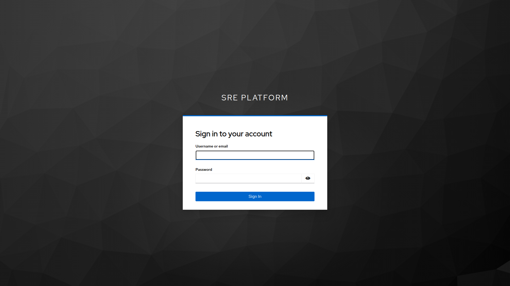
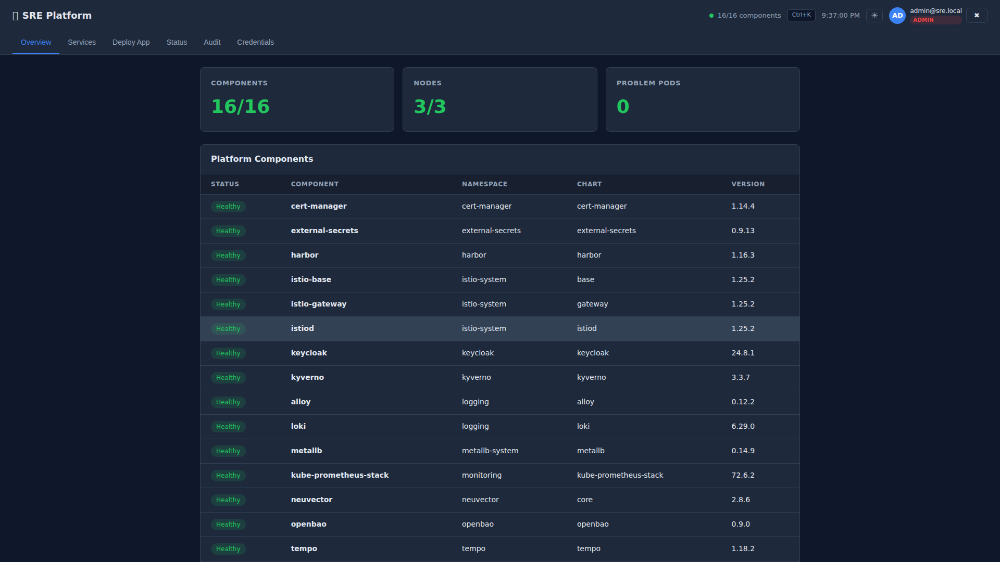
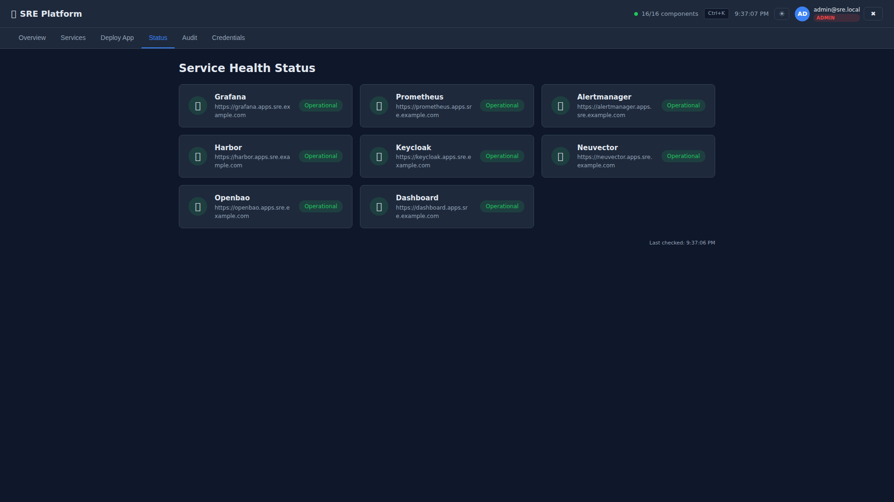
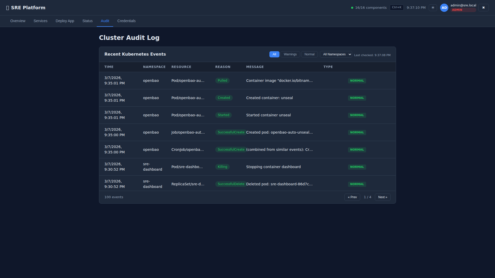
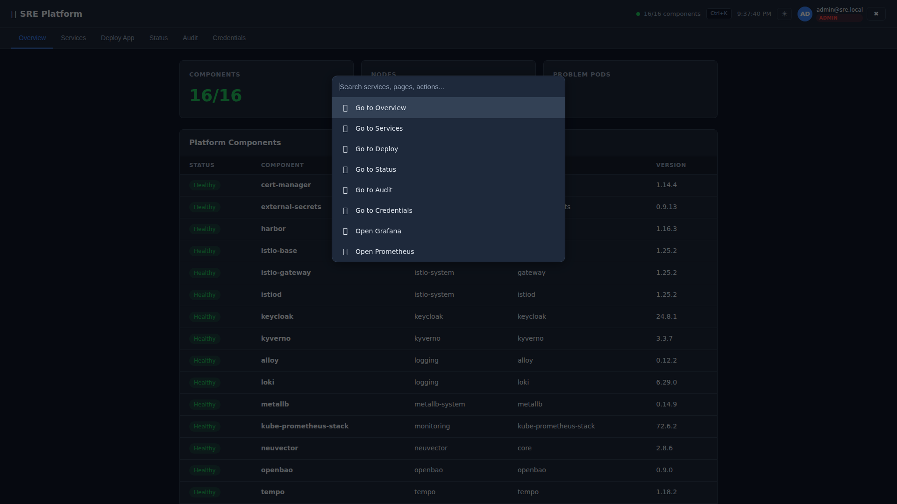
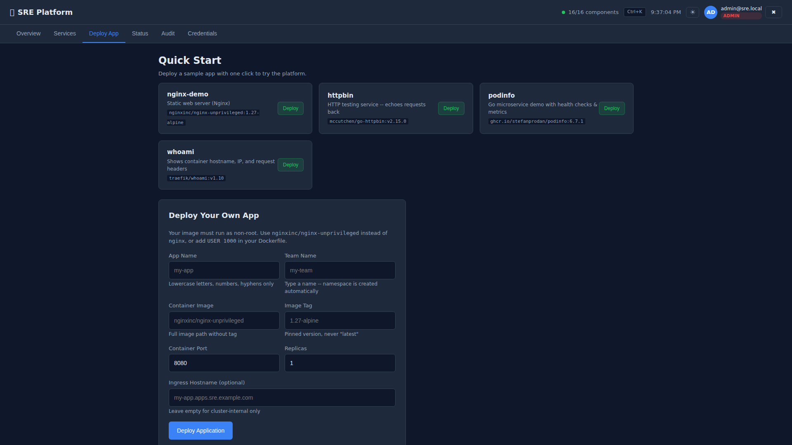
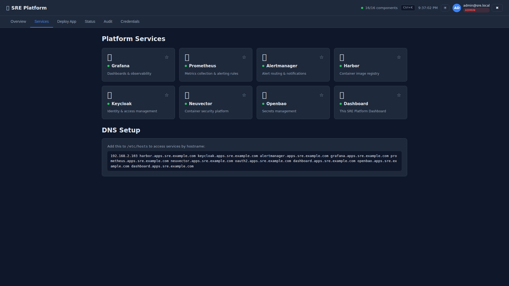
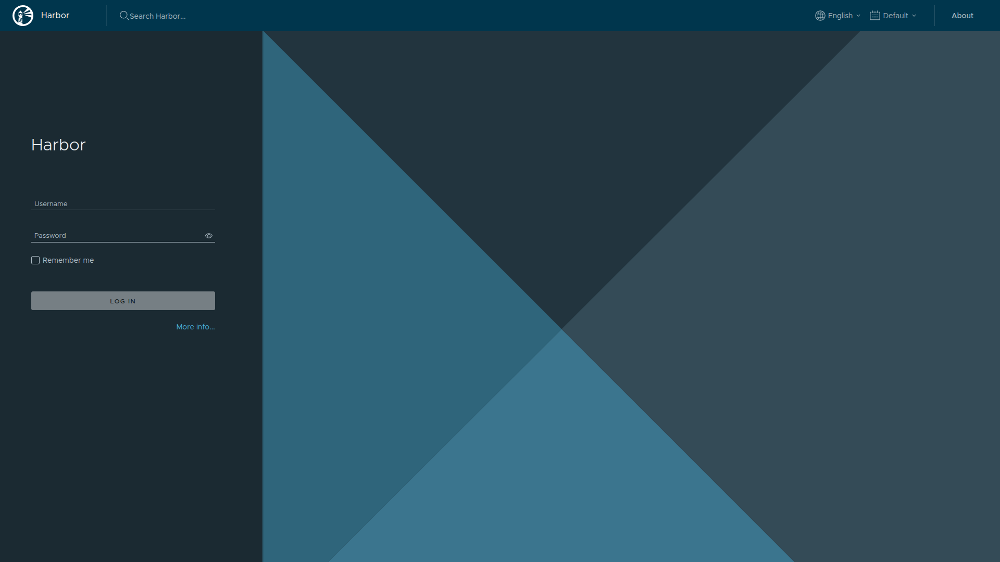
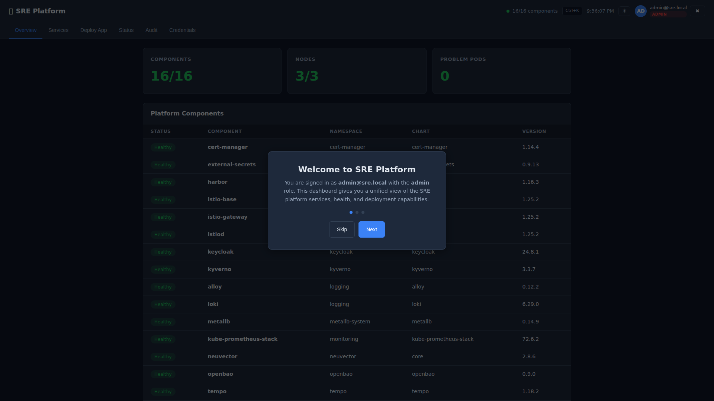
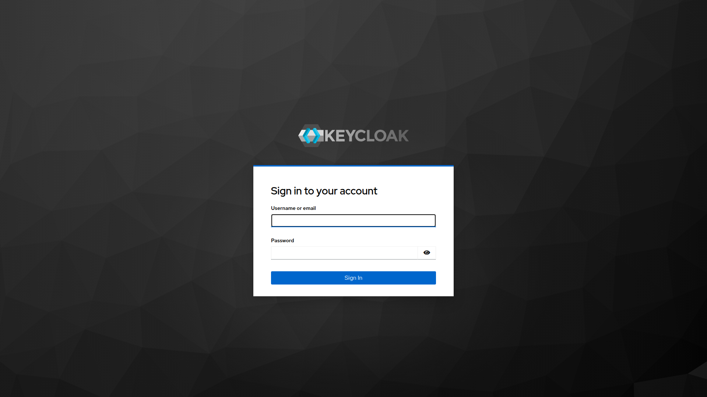

# User Stories & Walkthroughs

This document defines every user persona for the SRE Platform and walks through their day-to-day tasks with screenshots.

---

## User Personas

| Persona | Role | Goals | Access Level |
|---------|------|-------|-------------|
| **Platform Admin** | SRE / DevOps engineer who operates the cluster | Monitor cluster health, manage components, onboard teams, investigate incidents | `sre-admins` group (full access) |
| **Application Developer** | Engineer deploying their team's services | Deploy apps, check logs, view metrics, manage secrets | `developers` group (namespace-scoped) |
| **Security Officer** | InfoSec / compliance staff auditing the platform | Review policies, audit logs, vulnerability scans, compliance artifacts | `sre-admins` group (read-focused) |
| **Team Lead / Manager** | Non-technical stakeholder checking status | View service health, read dashboards, check uptime | `sre-viewers` group (read-only) |
| **New Hire / Onboarding User** | Just got access, needs to learn the platform | Get oriented, find documentation, deploy first app | `developers` group |
| **Incident Responder** | On-call engineer investigating an alert | Triage alerts, check logs, trace requests, identify root cause | `sre-admins` group |

---

## Persona 1: Platform Admin

**Name:** Sarah, SRE Engineer
**Goal:** Keep the platform healthy, onboard new teams, deploy infrastructure changes

### Story 1.1: Morning Health Check

> *As a Platform Admin, I want to see the health of all platform components at a glance so I can catch issues before they affect users.*

**Steps:**
1. Open `https://dashboard.apps.sre.example.com`
2. Authenticate via Keycloak SSO (one-time per session)
3. View the Overview tab showing component health

**What Sarah sees:**


*Step 1: All services are behind SSO. Click "Sign in with Keycloak" to authenticate.*


*Step 2: Enter credentials. MFA can be enforced per Keycloak policy.*


*Step 3: 16/16 components healthy, 3/3 nodes up, 0 problem pods. Every HelmRelease, its namespace, chart name, and version are visible.*

**Outcome:** Sarah confirms all components are green in under 10 seconds.

---

### Story 1.2: Check Service Health Status

> *As a Platform Admin, I want a status page showing which services are reachable so I can quickly identify outages.*

**Steps:**
1. Click the **Status** tab
2. View all service health checks


*All 8 platform services showing "Operational" with their public URLs.*

**Outcome:** Sarah can share this status page URL with stakeholders during incidents.

---

### Story 1.3: Investigate Cluster Events

> *As a Platform Admin, I want to review recent Kubernetes events filtered by type and namespace so I can investigate issues.*

**Steps:**
1. Click the **Audit** tab
2. Filter by "Warnings" to see only warning events
3. Filter by namespace to narrow scope
4. Page through results (25 per page)


*Tabular audit log with filters for type (All/Warnings/Normal), namespace dropdown, pagination, and color-coded reason badges.*

**Outcome:** Sarah quickly finds the warning events in a specific namespace without scrolling through hundreds of normal events.

---

### Story 1.4: Onboard a New Team

> *As a Platform Admin, I want to create a new team namespace with all security controls pre-configured so developers can start deploying immediately.*

**Steps:**
```bash
# One command creates: namespace, RBAC, quotas, network policies,
# Harbor project, OpenBao path, Keycloak group mapping
./scripts/onboard-tenant.sh team-gamma

# Or use the Deploy App tab in the dashboard
```

**What gets created:**
- Kubernetes namespace `team-team-gamma` with Istio injection
- ResourceQuota (CPU/memory limits per namespace)
- LimitRange (default pod resource limits)
- Default-deny NetworkPolicy
- RBAC binding to Keycloak group `team-gamma`
- Harbor project for container images
- OpenBao secrets path

**Outcome:** The team can deploy apps within minutes, and every security control is already in place.

---

### Story 1.5: Quick Navigation with Command Palette

> *As a Platform Admin, I want to quickly navigate between dashboard sections and open external services without clicking through menus.*

**Steps:**
1. Press `Ctrl+K` from anywhere in the dashboard
2. Type to search: pages, services, or actions
3. Select an item to navigate instantly


*Ctrl+K opens a searchable command palette with quick links to all dashboard pages and external services (Grafana, Prometheus, etc.)*

**Outcome:** Power users navigate the platform in 2 keystrokes instead of multiple clicks.

---

## Persona 2: Application Developer

**Name:** Marcus, Backend Engineer on Team Alpha
**Goal:** Deploy and monitor his team's microservices

### Story 2.1: Deploy a New Service (One-Click)

> *As a Developer, I want to deploy my containerized app with one click and have the platform handle security, networking, and monitoring automatically.*

**Steps:**
1. Click the **Deploy App** tab
2. Choose a quick-start template or fill in the custom form
3. Enter: app name, team, container image, tag, port
4. Click **Deploy Application**


*Quick Start templates (nginx, httpbin, podinfo, whoami) for instant demos. Custom deployment form below with validation hints.*

**What the platform does automatically:**
- Creates a Deployment with hardened security context (non-root, read-only rootfs, drop ALL capabilities)
- Adds a NetworkPolicy (default-deny with Istio gateway ingress)
- Configures a ServiceMonitor for Prometheus scraping
- Injects Istio sidecar for mTLS encryption
- Sets up liveness/readiness probes
- Creates an Istio VirtualService for external access (if hostname provided)

**Outcome:** Marcus goes from "I have a container image" to "my app is running securely in production" in 30 seconds.

---

### Story 2.2: Deploy from Git

> *As a Developer, I want to deploy my app by pushing to Git so the platform handles the rest via GitOps.*

**Steps:**
```bash
# Interactive deployment — generates YAML and commits to Git
./scripts/deploy-from-git.sh https://github.com/team-alpha/my-service.git

# Flux detects the change and deploys automatically
flux get helmreleases -n team-team-alpha
```

**Outcome:** Marcus's preferred workflow — push code, everything else is automated.

---

### Story 2.3: Find Service Credentials

> *As a Developer, I want to find the URLs and credentials for platform services so I can integrate my app with monitoring and logging.*

**Steps:**
1. Click the **Credentials** tab
2. Copy the Grafana, Harbor, or other service credentials


*Credentials tab shows all service URLs, usernames, and passwords for admin access. (Note: production deployments use SSO — these are fallback credentials.)*

**Outcome:** Marcus gets the Grafana URL and can immediately create dashboards for his service.

---

### Story 2.4: Check Platform Services

> *As a Developer, I want to see all available platform services and their health so I know what tools are available to me.*

**Steps:**
1. Click the **Services** tab
2. View all services with health indicators and direct links
3. Copy the `/etc/hosts` entry for local access


*8 platform services with health dots. DNS Setup section shows the /etc/hosts line to add for local access.*

**Outcome:** Marcus can see what's available, whether it's healthy, and how to access it.

---

## Persona 3: Security Officer

**Name:** Diana, Information Security Analyst
**Goal:** Audit platform security controls and generate compliance evidence

### Story 3.1: Review Active Security Policies

> *As a Security Officer, I want to see what Kyverno policies are enforced so I can verify compliance controls are active.*

**Steps:**
```bash
# View all active policies
kubectl get clusterpolicy

# Expected output:
# disallow-latest-tag          Enforce   true
# require-labels               Enforce   true
# require-network-policies     Enforce   true
# require-security-context     Enforce   true
# restrict-image-registries    Enforce   true
# require-istio-sidecar        Audit     true
# verify-image-signatures      Audit     true
```

**What each policy enforces:**
| Policy | NIST Control | What It Prevents |
|--------|-------------|-----------------|
| `disallow-latest-tag` | CM-2 | Unpinned container image versions |
| `require-labels` | CM-8 | Resources without ownership/classification labels |
| `require-network-policies` | AC-4, SC-7 | Namespaces without default-deny network rules |
| `require-security-context` | AC-6, CM-7 | Privileged or root containers |
| `restrict-image-registries` | CM-11, SA-10 | Images from unapproved registries |
| `verify-image-signatures` | SI-7, SA-10 | Unsigned container images |

**Outcome:** Diana confirms 7 policies are active and maps each to NIST 800-53 controls.

---

### Story 3.2: Audit Cluster Events

> *As a Security Officer, I want to review cluster events for suspicious activity so I can detect unauthorized changes.*

**Steps:**
1. Open the **Audit** tab on the dashboard
2. Filter by "Warnings" to focus on anomalies
3. Filter by specific namespaces to narrow scope


*Tabular audit view with 100 events, paginated 25 per page. Warning filter highlights potential issues.*

**For deeper analysis:**
```bash
# Grafana → Explore → Loki data source
# Query: {namespace="production"} |= "error"

# Or check Kyverno policy violations
kubectl get policyreport -A
kubectl get clusterpolicyreport
```

**Outcome:** Diana has audit evidence for AU-2 (Audit Events) and AU-6 (Audit Review).

---

### Story 3.3: Generate Compliance Artifacts

> *As a Security Officer, I want machine-readable compliance artifacts so I can submit them for ATO assessment.*

**Steps:**
```bash
# Generate OSCAL System Security Plan
cat compliance/oscal/ssp.json | python3 -m json.tool | head -20

# View NIST 800-53 control coverage
cat compliance/nist-800-53-mappings/control-mapping.json | python3 -m json.tool

# Run compliance scanner
kubectl get cronjob compliance-scanner -n monitoring
```

**Available artifacts:**
| Artifact | Format | Path |
|----------|--------|------|
| System Security Plan | OSCAL JSON | `compliance/oscal/ssp.json` |
| NIST 800-53 Mapping | JSON | `compliance/nist-800-53-mappings/control-mapping.json` |
| CMMC Level 2 Assessment | JSON | `compliance/cmmc/level2-assessment.json` |
| RKE2 STIG Checklist | JSON | `compliance/stig-checklists/rke2-stig.json` |

**Outcome:** Diana exports compliance evidence in standard formats for assessors.

---

### Story 3.4: Review Container Vulnerabilities

> *As a Security Officer, I want to see vulnerability scan results for all container images so I can ensure nothing critical is deployed.*

**Steps:**
1. Open Harbor: `https://harbor.apps.sre.example.com`
2. Browse projects and image repositories
3. Click any image tag to see Trivy scan results


*Harbor login page. Projects contain team images with automatic Trivy scanning on push.*

**Outcome:** Diana verifies RA-5 (Vulnerability Scanning) compliance with real scan results.

---

## Persona 4: Team Lead / Manager

**Name:** Alex, Engineering Manager
**Goal:** Check platform health and team deployment status without deep technical knowledge

### Story 4.1: Check "Is Everything Working?"

> *As a Team Lead, I want a simple yes/no answer to "is the platform healthy?" without running any commands.*

**Steps:**
1. Open `https://dashboard.apps.sre.example.com`
2. Look at the top bar: green dot = all good


*Top-right shows "16/16 components" with a green indicator. Summary cards show component count, node count, and problem pods.*

**Outcome:** Alex sees green and moves on. If it's red, he escalates to the SRE team.

---

### Story 4.2: View Service Status for Stakeholders

> *As a Team Lead, I want a shareable status page showing which services are up so I can report to leadership.*


*Clean status page with all 8 services showing "Operational." Shareable URL.*

**Outcome:** Alex shares the Status tab URL in a Slack channel for team visibility.

---

## Persona 5: New Hire / Onboarding User

**Name:** Jordan, Junior Developer (Day 1)
**Goal:** Get access, understand what's available, deploy first app

### Story 5.1: First Login & Orientation

> *As a New Hire, I want a guided introduction to the platform so I know what's available and how to use it.*

**Steps:**
1. Open `https://dashboard.apps.sre.example.com`
2. Sign in with Keycloak credentials (provided by admin)
3. See the onboarding wizard


*First-login wizard: "Welcome to SRE Platform. You are signed in as admin@sre.local with the admin role."*

**The wizard walks through:**
1. What the platform provides (security, monitoring, GitOps)
2. How to deploy your first app
3. Where to find documentation

**Outcome:** Jordan understands the platform capabilities in 2 minutes.

---

### Story 5.2: Deploy First App (Zero Experience)

> *As a New Hire, I want to deploy a sample app to see how the platform works before deploying my own code.*

**Steps:**
1. Click **Deploy App** tab
2. Click **Deploy** next to "nginx-demo" under Quick Start
3. Watch it deploy in real time


*Quick Start section: one-click deploy of nginx-demo, httpbin, podinfo, or whoami. No configuration needed.*

**Outcome:** Jordan has a running app in 30 seconds and understands the deployment flow.

---

## Persona 6: Incident Responder

**Name:** Kai, On-Call SRE
**Goal:** Triage an alert, find root cause, resolve the incident

### Story 6.1: Triage a Firing Alert

> *As an Incident Responder, I want to quickly identify what's broken and where so I can start remediation.*

**Steps:**
1. Receive PagerDuty/Slack alert (links to Alertmanager)
2. Open dashboard — check Overview for red indicators
3. Click **Audit** tab — filter by "Warnings" to see recent issues
4. Open Grafana for deep metrics analysis

**Triage workflow:**
```
Alert fires → Dashboard (Overview) → What's unhealthy?
                                   → Audit tab → Recent events
                                   → Grafana → Detailed metrics
                                   → Loki → Pod logs
                                   → Tempo → Request traces
```

**Outcome:** Kai identifies the failing component, namespace, and pod within 2 minutes.

---

### Story 6.2: Check NeuVector for Runtime Security Events

> *As an Incident Responder, I want to see if NeuVector detected any anomalous container behavior that could indicate a security incident.*

**Steps:**
1. Open `https://neuvector.apps.sre.example.com`
2. Check Security Events for process/network anomalies
3. Review NeuVector's network microsegmentation map


*NeuVector provides runtime container security: behavioral monitoring, network visualization, and CIS benchmarks.*

**Outcome:** Kai confirms whether the incident is operational or security-related.

---

## Cross-Persona Features

### SSO Across All Services

Every user benefits from single sign-on. One Keycloak login grants access to:
- SRE Dashboard
- Grafana (metrics & dashboards)
- Prometheus (direct PromQL)
- Alertmanager (alert management)
- Harbor (container registry)
- NeuVector (runtime security)
- OpenBao (secrets vault)

### RBAC by Group

| Keycloak Group | Dashboard | Deploy Apps | View Metrics | Manage Policies | Cluster Admin |
|---------------|:---------:|:-----------:|:------------:|:---------------:|:-------------:|
| `sre-admins` | Full | Yes | Yes | Yes | Yes |
| `developers` | Full | Own namespace | Yes | View only | No |
| `sre-viewers` | Read-only | No | Yes | View only | No |

### Mobile Responsive

The dashboard works on mobile devices for on-the-go health checks.


*Dashboard adapts to mobile screens for quick health checks from a phone.*

---

## Summary

| Persona | Primary Dashboard Tab | External Tools Used | Key Outcome |
|---------|----------------------|--------------------|----|
| Platform Admin | Overview, Status, Audit | Grafana, kubectl | Cluster is healthy, teams are onboarded |
| Developer | Deploy App, Services, Credentials | Harbor, Grafana | App is deployed securely in 30 seconds |
| Security Officer | Audit | Kyverno reports, Harbor scans, compliance artifacts | Controls verified, evidence exported |
| Team Lead | Overview, Status | None | "Is it green? Yes." |
| New Hire | Deploy App (Quick Start) | None | First app running in 30 seconds |
| Incident Responder | Overview, Audit | Grafana, Loki, Tempo, NeuVector | Root cause identified in 2 minutes |
